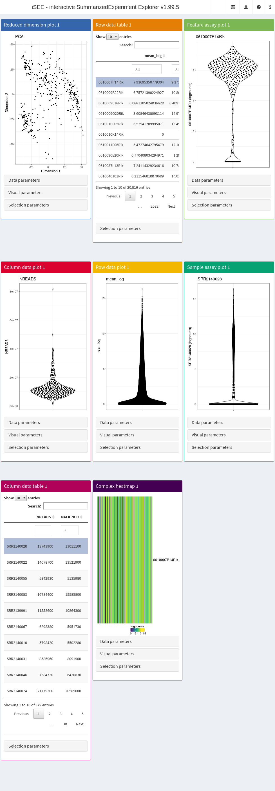

# An introduction to the iSEE interface

**Compiled date**: 2025-11-16

**Last edited**: 2020-04-20

**License**: MIT + file LICENSE

## Introduction

*[iSEE](https://bioconductor.org/packages/3.23/iSEE)* is a
[Bioconductor](http://bioconductor.org) package that provides an
interactive Shiny-based graphical user interface for exploring data
stored in `SummarizedExperiment` objects (Rue-Albrecht et al. 2018).
Instructions to install the package are available
[here](https://bioconductor.org/packages/3.23/iSEE). Once installed, the
package can be loaded and attached to your current workspace as follows:

``` r

library(iSEE)
```

If you have a `SummarizedExperiment` object[^1] named `se`, you can
launch an *[iSEE](https://bioconductor.org/packages/3.23/iSEE)* app by
running:

``` r

iSEE(se)
```

In this vignette, we demonstrate this process using the `allen`
single-cell RNA-seq data set from the
*[scRNAseq](https://bioconductor.org/packages/3.23/scRNAseq)* package.
However, if you want to start playing with the app immediately, you can
simply run:

``` r

example(iSEE, ask=FALSE)
```

## Setting up the data

The `allen` data set contains expression values for 379 cells from the
mouse visual cortex (Tasic et al. 2016), and can be loaded directly by
calling
[`ReprocessedAllenData()`](https://rdrr.io/pkg/scRNAseq/man/ReprocessedData.html)
and specifying the value for the `assays` parameter. To begin with, we
assign the output of this call to an `sce` object and inspect it.

``` r

library(scRNAseq)
sce <- ReprocessedAllenData(assays = "tophat_counts")   # specifying the assays to speed up the example
sce
#> class: SingleCellExperiment 
#> dim: 20816 379 
#> metadata(2): SuppInfo which_qc
#> assays(1): tophat_counts
#> rownames(20816): 0610007P14Rik 0610009B22Rik ... Zzef1 Zzz3
#> rowData names(0):
#> colnames(379): SRR2140028 SRR2140022 ... SRR2139341 SRR2139336
#> colData names(22): NREADS NALIGNED ... Animal.ID passes_qc_checks_s
#> reducedDimNames(0):
#> mainExpName: endogenous
#> altExpNames(1): ERCC
```

As provided, the `sce` object contains raw data and a number of quality
control and experimental cell annotations, all available in
`colData(sce)`.

``` r

colnames(colData(sce))
#>  [1] "NREADS"                       "NALIGNED"                    
#>  [3] "RALIGN"                       "TOTAL_DUP"                   
#>  [5] "PRIMER"                       "PCT_RIBOSOMAL_BASES"         
#>  [7] "PCT_CODING_BASES"             "PCT_UTR_BASES"               
#>  [9] "PCT_INTRONIC_BASES"           "PCT_INTERGENIC_BASES"        
#> [11] "PCT_MRNA_BASES"               "MEDIAN_CV_COVERAGE"          
#> [13] "MEDIAN_5PRIME_BIAS"           "MEDIAN_3PRIME_BIAS"          
#> [15] "MEDIAN_5PRIME_TO_3PRIME_BIAS" "driver_1_s"                  
#> [17] "dissection_s"                 "Core.Type"                   
#> [19] "Primary.Type"                 "Secondary.Type"              
#> [21] "Animal.ID"                    "passes_qc_checks_s"
```

Then, we normalize the expression values with
*[scater](https://bioconductor.org/packages/3.23/scater)*.

``` r

library(scater)
sce <- logNormCounts(sce, exprs_values="tophat_counts")
```

Next, we apply PCA and *t*-SNE to generate two low-dimensional
representations of the cells. The dimensionality reduction results are
stored in `reducedDim(sce)`.

``` r

set.seed(1000)
sce <- runPCA(sce)
sce <- runTSNE(sce)
reducedDimNames(sce)
#> [1] "PCA"  "TSNE"
```

At this point, the `sce` object does not contain any annotations for the
rows (i.e., features) in the data set. Thus, to prepare a fully-featured
example application, we also add some gene metadata to the `rowData`
related to the mean-variance relationship in the data.

``` r

rowData(sce)$mean_log <- rowMeans(logcounts(sce))
rowData(sce)$var_log <- apply(logcounts(sce), 1, var)
```

It is important to note that `iSEE` relies primarily on precomputed
values stored in the various slots of objects derived from the
`SummarizedExperiment` class[^2]. This allows users to visualize any
metrics of interest, but also requires these to be calculated and added
to the object before the initialization of the app. That said, it is
straightforward to iteratively explore a precomputed object, take notes
of new metrics to compute, close the app, store new results in the
`SummarizedExperiment` object, and launch a new app using the updated
object.

## Launching the interface

To begin the exploration, we create an `iSEE` app with the
`SingleCellExperiment` object generated above. In its simplest form, the
`iSEE` function only requires the input object. However,
*[iSEE](https://bioconductor.org/packages/3.23/iSEE)* applications can
be extensively
[reconfigured](https://bioconductor.org/packages/3.23/iSEE/vignettes/configure.html)
using a number of optional arguments to the `iSEE` function.

``` r

app <- iSEE(sce)
```

The `runApp` function launches the app in our browser.

``` r

shiny::runApp(app)
```



Basic demo.

By default, the app starts with a dashboard that contains one panel or
table of each type. By opening the collapsible panels named “Data
parameters”, “Visual parameters”, and “Selection parameters” under each
plot, we can control the content and appearance of each panel.

Now, look in the upper right corner for a question mark icon (), and
click on the hand button () for an introductory tour. This will perform
an interactive tour of the app, based on the
*[rintrojs](https://CRAN.R-project.org/package=rintrojs)* package (Ganz
2016). During this tour, you will be taken through the different
components of the *[iSEE](https://bioconductor.org/packages/3.23/iSEE)*
user interface and learn the basic usage mechanisms by doing small
actions guided by the tutorial: the highlighted elements will be
responding to your actions, while the rest of the UI will be shaded. You
can move forward and backward along the tour by clicking on the
“Next”/“Back” buttons, or also using the arrow keys. You can even jump
to a particular step by clicking on its circle. To exit the tour, either
click on “Skip”, or simply click outside of the highlighted UI element.

Once you are done generating plots, click on the export icon () in the
upper right corner, and click on the magic wand button () to display R
code that you can export and directly re-use in your R session. This
will open a modal popup where the R code used to generate the plots is
displayed in a
*[shinyAce](https://CRAN.R-project.org/package=shinyAce)*-based text
editor. Select parts or all of it to copy-and-paste it into your
analysis script/Rmarkdown file. However, note that the order in which
the code blocks are reported is important if you have linked panels to
one another, as the panels sending point selections must be executed
before those that receive the corresponding selection.

## Description of the user interface

### Header

The layout of the *[iSEE](https://bioconductor.org/packages/3.23/iSEE)*
user interface uses the
*[shinydashboard](https://CRAN.R-project.org/package=shinydashboard)*
package. The dashboard header contains four dropdown menus.

The first icon in the dashboard header is the “Organization” menu, which
is identified by an icon displaying multiple windows (). This menu
contains two items:

- The “Organize panels” button. Click on this button to open a modal
  window that contains:
  - A selectize input to add, remove, and reorder panels in the main
    interface.
  - Two inputs to control the width and height, respectively, of each
    panel selected above. Note that panel width is defined in integer
    grid units between 1 and 12 (see
    [`?shiny::column`](https://rdrr.io/pkg/shiny/man/column.html)). In
    contrast, panel height is defined in pixels (see
    [`?shiny::plotOutput`](https://rdrr.io/pkg/shiny/man/plotOutput.html)).
- The “Examine panel chart” functionality, identified by a chain icon
  (). Click on this button to obtain a graph representation of the
  existing links and point selections among your visible plot and table
  panels. Every panel is represented by a node coded with the same color
  as in the app. This can be very useful in sessions that include a
  large number of panels, to visualize the relationship structure
  between the various panels that send and receive selections of data
  points.

The second icon in the dashboard header is the “Export” dropdown menu,
which is identified by a download icon () and contains:

- The “Download panel output” functionality, identified by the download
  icon (). Here, you can download a zip folder with the currently
  displayed panel content (high-resolution figures and table contents as
  csv files).
- The “Extract the R code”, functionality (). At any point during your
  live session, you might want to record the code that reproduces
  exactly the state of each plot. Clicking on this button opens a modal
  popup window, with a
  *[shinyAce](https://CRAN.R-project.org/package=shinyAce)*-based text
  editor, where the code is formatted and displayed with syntax
  highlighting. You can copy the code to the clipboard by selecting the
  text (please do include the initial lines and the
  [`sessionInfo()`](https://rdrr.io/r/utils/sessionInfo.html) commands
  for best tracking of your environment), and store it in your analysis
  report/script. This code can then be further edited to finalize the
  plots (e.g., for publication).
- The “Display panel settings” () button, which lets you export the code
  defining the state of the current panels in the interface. This is
  useful if you want to preconfigure an
  *[iSEE](https://bioconductor.org/packages/3.23/iSEE)* instance to
  start in the current state, rather than with the default set of
  panels.

The “Documentation” dropdown menu is accessible through the question
mark icon (), which contains:

- The button to start an interactive tour () of
  *[iSEE](https://bioconductor.org/packages/3.23/iSEE)*, which allows
  users to learn the basic usage mechanisms by doing. During a tour, the
  highlighted elements respond to the user’s actions, while the rest of
  the UI is shaded.
- The button to “Open the vignette” (), which displays the
  *[iSEE](https://bioconductor.org/packages/3.23/iSEE)* vignette, either
  available on your system or accessed at the webpage of the package on
  the Bioconductor project site. In the latter case, the vignette will
  refer to the current release or development version, according to the
  version of the package installed on your system).

The “Additional Information” dropdown menu is accessible through the
information icon (), and contains:

- The “About this session” button (), which reports the output of the
  [`sessionInfo()`](https://rdrr.io/r/utils/sessionInfo.html) function
  in a modal popup window. This is particularly useful for reproducing
  or reporting the environment, especially when reporting errors or
  unexpected behaviors.
- The “About iSEE” button () shows the information on the development
  team, licensing and citation information for the
  *[iSEE](https://bioconductor.org/packages/3.23/iSEE)* package. You can
  follow the development of the package by checking the GitHub
  repository (<https://github.com/iSEE/iSEE>), where new functionality
  will be added. Well-considered suggestions in the form of issues or
  pull requests are welcome.

### Body

#### Overview of panel types

The main element in the body of
*[iSEE](https://bioconductor.org/packages/3.23/iSEE)* is the combination
of panels, generated (and optionally linked to one another) according to
your actions. There are currently eight standard panel types that can be
generated with *[iSEE](https://bioconductor.org/packages/3.23/iSEE)*:

- Reduced dimension plot
- Column data table
- Column data plot
- Feature assay plot
- Row data table
- Row data plot
- Sample assay plot
- Complex heatmap

In addition, custom panel types can be defined as described in a
[separate dedicated
vignette](https://bioconductor.org/packages/3.23/iSEE/vignettes/custom.html).
The panels and models in the
*[iSEEu](https://bioconductor.org/packages/3.23/iSEEu)* package provide
additional flexibility.

For each standard plot panel, three different sets of parameters will be
available in collapsible boxes:

- “Data parameters”, to control parameters specific to each type of
  plot.
- “Visual parameters”, to specify parameters that will determine the
  aspect of the plot, in terms of coloring, point features, and more
  (e.g., legend placement, font size).
- “Selection parameters” to control the incoming point selection and
  link relationships to other plots.

#### Reduced dimension plots

If a `SingleCellExperiment` object is supplied to the `iSEE` function,
reduced dimension results are extracted from the `reducedDim` slot.
Examples include low-dimensional embeddings from principal components
analysis (PCA) or *t*-distributed stochastic neighbour embedding
(*t*-SNE) (Van der Maaten and Hinton 2008). These results are used to
construct a two-dimensional *Reduced dimension plot* where each point is
a sample, to facilitate efficient exploration of high-dimensional
datasets. The “Data parameters” control the `reducedDim` slot to be
displayed, as well as the two dimensions to plot against each other.

Note that this builtin panel does not compute reduced dimension
embeddings; they must be precomputed and available in the object
provided to the `iSEE` function. Nevertheless, custom panels - such as
the *[iSEEu](https://bioconductor.org/packages/3.23/iSEEu)*
`DynamicReducedDimensionPlot` can be developed and used to enable such
features.

#### Column data plots

A *Column data plot* visualizes sample metadata stored in the
`SummarizedExperiment` column metadata. Different fields can be used for
the x- and y-axes by selecting appropriate values in the “Data
parameters” box. This plot can assume various forms, depending on the
nature of the data on the x- and y-axes:

- If the y-axis is continuous and the x-axis is categorical, violin
  plots are generated (grouped by the x-axis factor).
- If the y-axis is categorical and the x-axis is continuous, horizontal
  violin plots are generated (grouped by the y-axis factor).
- If both axes are continuous, a scatter plot is generated. This enables
  the use of contours that are overlaid on top of the plot, check the
  `"Other"` box to see the available options.
- If both axes are categorical, a plot of squares (Hinton plot) is
  generated where the area of each square is proportional to the number
  of samples within each combination of factor levels.

Note that an x-axis setting of “None” is considered to be categorical
with a single level.

#### Feature assay plots

A *Feature assay plot* visualizes the assayed values (e.g., gene
expression) for a particular feature (e.g., gene) across the samples on
the y-axis. This usually results in a (grouped) violin plot, if the
x-axis is set to `"None"` or a categorical variable; or a scatter plot,
if the x-axis is another continuous variable[^3].

Gene selection for the y-axis can be achieved by using a *linked row
data table* in another panel. Clicking on a row in the table
automatically changes the assayed values plotted on the y-axis.
Alternatively, the row name can be directly entered as text that
corresponds to an entry of `rownames(se)`[^4].

The x-axis covariate can also be selected from the plotting parameters.
This can be `"None"`, sample metadata, or the assayed values of another
feature (also identified using a linked table or via text). The
measurement units are selected as one of the `assays(se)`, which is
applied to both the X and Y axes.

Obviously, any other assayed value for any feature can be visualized in
this manner, not limited to the expression of genes. The only
requirement for this type of panel is that the observations can be
stored as a matrix in the `SummarizedExperiment` object.

#### Row data plots

A *Row data plot* allows the visualization of information stored in the
`rowData` slot of a `SummarizedExperiment` object. Its behavior mirrors
the implementation for the *Column data plot*, and correspondingly this
plot can assume various forms depending on whether the data are
categorical or continuous.

#### Sample assay plots

A *Sample assay plot* visualizes the assayed values (e.g., gene
expression) for a particular sample (e.g., cell) across the features on
the y-axis.

This usually results in a (grouped) violin plot, if the x-axis is set to
`"None"` or a categorical variable (e.g., gene biotype); or a scatter
plot, if the x-axis is another continuous variable.

Notably, the x-axis covariate can also be set to:

- A discrete row data covariates (e.g., gene biotype), to stratify the
  distribution of assayed values
- A continuous row data covariate (e.g., count of cells expressing each
  gene)
- Another sample, to visualize and compare the assayed values in any two
  samples.

#### Row data tables

A *Row data table* contains the values of the `rowData` slot for the
`SingleCellExperiment`/`SummarizedExperiment` object. If none are
available, a column named `Present` is added and set to `TRUE` for all
features, to avoid issues with
[`DT::datatable`](https://rdrr.io/pkg/DT/man/datatable.html) and an
empty `DataFrame`. Typically, these tables are used to link to other
plots to determine the features to use for plotting or coloring.
However, they can also be used to retrieve gene-specific annotation on
the fly by specifying the `annotFun` parameter, e.g. using the
`annotateEntrez` or `annotateEnsembl` functions, provided in
*[iSEE](https://bioconductor.org/packages/3.23/iSEE)*. Alternatively,
users can create a customized annotation function; for more details on
this, please consult the manual pages `?annotateEntrez` and
`?annotateEnsembl`.

#### Column data tables

A *Column data table* contains the values of the `colData` slot for the
`SingleCellExperiment`/`SummarizedExperiment` object. Its behavior
mirrors the implementation for the *Row data table*. Correspondingly, if
none are available, a column named `Present` is added and set to `TRUE`
for all samples, to avoid issues with
[`DT::datatable`](https://rdrr.io/pkg/DT/man/datatable.html) and an
empty `DataFrame`. Typically, these tables are used to link to other
plots to determine the samples to use for plotting or coloring.

#### Heat maps

*Heat map* panels provide a compact overview of the data for multiple
features in the form of color-coded matrices. These correspond to the
`assays` stored in the `SummarizedExperiment` object, where features
(e.g., genes) are the rows and samples are the columns.

User can select features (rows) to display from the selectize widget
(which supports autocompletion), or also via other panels, like row data
plots or row data tables. In addition, users can rapidly import custom
lists of feature names using a modal popup that provides an [Ace
editor](https://ace.c9.io/) where they can directly type of paste
feature names, and a file upload button that accepts text files
containing one feature name per line. Users should remember to click the
“Apply” button before closing the modal, to update the heat map with the
new list of features.

The “Suggest feature order” button clusters the rows, and also
rearranges the elements in the selectize according to the clustering. It
is also possible to choose which assay type is displayed (`"logcounts"`
being the default choice, if available). Samples in the heat map can
also be annotated, simply by selecting relevant column metadata. A
zooming functionality is also available, restricted to the y-axis (i.e.,
allowing closer inspection on the individual features included).

## Description of iSEE functionality

### Coloring plots by sample attributes

Column-based plots are the reduced dimension, feature assay and column
data plots, where each data point represents a sample. Here, data points
can be colored in different ways:

- The default is no color scheme (`"None"` in the radio button). This
  results in data points of a constant user-specified color.
- Any column of `colData(se)` can be used. The plot automatically
  adjusts the scale to use based on whether the chosen column is
  continuous or categorical.
- The assay values of a particular feature in each sample can be used.
  The feature can be chosen either via a linked row table or selectize
  input (as described for the *Feature assay plot* panel). Users can
  also specify the `assays` from which values are extracted.
- The identity of a particular sample can be used, which will be
  highlighted on the plot in a user-specified color. The sample can be
  chosen either via a linked column table or via a selectize input.

For row-based plots (i.e., the sample assay and row data plots), each
data point represents a feature. Like the column-based plots, data
points can be colored by:

- `"None"`, yielding data points of fixed color.
- Any column of `rowData(se)`.
- The identity of a particular *feature*, which is highlighted in the
  user-specified color.
- Assay values for a particular *sample*.

Fine control of the color maps is possible through the
`ExperimentColorMap` class, see [this
vignette](https://bioconductor.org/packages/3.23/iSEE/vignettes/ecm.html)
for more details.

### Controlling point aesthetics

Data points can be set to different shapes according to categorical
factors in `colData(se)` (for column-based plots) or `rowData(se)` (for
row-based plots). This is achieved by checking the `"Shape"` box to
reveal the shape-setting options. The size and opacity of the data
points can be modified via the options available by checking the
`"Point"` box. This may be useful for aesthetically pleasing
visualizations when the number of points is very large or small.

### Faceting

Each point-based plot can be split into multiple facets using the
options in the `"Facet"` checkbox. Users can facet by row and/or column,
using categorical factors in `colData(se)` (for column-based plots) or
`rowData(se)` (for row-based plots). This provides a convenient way to
stratify points in a single plot by multiple factors of interest. Note
that point selection can only occur *within* a single facet at a time;
points cannot be selected across facets.

### Zooming in and out

Zooming in is possible by first selecting a region of interest in a plot
using the brush (drag and select); double-clicking on the brushed area
then zooms into the selected area. To zoom out to the original plot,
simply double-click at any location in the plot.

## FAQ

**Q: Can you implement a ‘Copy to clipboard’ button in the code
editor?**

A: This is not necessary, as one can click anywhere in the code editor
and instantly select all the code using a keyboard shortcut that depends
on your operating system.

**Q: When brushing with a transparency effect, it seems that data points
in the receiving plot are not made transparent/subsetted correctly.**

A: What you see is an artefact of overplotting: in areas excessively
dense in points, transparency ceases to be an effective visual effect.

**Q: Brushing on violin or square plots doesn’t seem to select
anything.**

A: For violin plots, points will be selected only if the brushed area
includes the center of the x-tick, i.e., the center of the violin plot.
This is intentional as it allows easy selection of all points in complex
grouped violin plots. Indeed, the location of a specific point on the
x-axis has no meaning. The same logic applies to the square plots, where
only the center of each square needs to be selected to obtain all the
points in the square.

**Q: I’d like to try
*[iSEE](https://bioconductor.org/packages/3.23/iSEE)* but I can’t
install it/I just want a quick peek. Is there something you can do?**

A: We set up an instance of iSEE running on the `allen` dataset at this
address: <http://shiny.imbei.uni-mainz.de:3838/iSEE>. A range of
interactive tours showcasing a variety of data types is also available
here: <https://github.com/iSEE/iSEE2018>. Please keep in mind this is
only for demonstration purposes, yet those instances show how you or
your system administrator can setup
*[iSEE](https://bioconductor.org/packages/3.23/iSEE)* for analyzing
and/or sharing your `SummarizedExperiment`/`SingleCellExperiment`
precomputed object.

**Q: I would like to use
*[iSEE](https://bioconductor.org/packages/3.23/iSEE)* with my `Seurat`
object, how do I do?**

A: The *[Seurat](https://CRAN.R-project.org/package=Seurat)* package
provides `as.SingleCellExperiment()` to coerce `Seurat` objects to
`SingleCellExperiment` objects. This conversion includes assays, cell
metadata, feature metadata, and dimensionality reduction results. You
can then use the `SingleCellExperiment` object as usual.

## Additional information

Bug reports can be posted on the [Bioconductor support
site](https://support.bioconductor.org) or raised as issues in the
*[iSEE](https://github.com/iSEE/iSEE)* GitHub repository. The GitHub
repository also contains the development version of the package, where
new functionality is added over time. The authors appreciate
well-considered suggestions for improvements or new features, or even
better, pull requests.

If you use *[iSEE](https://bioconductor.org/packages/3.23/iSEE)* for
your analysis, please cite it as shown below:

``` r

citation("iSEE")
#> To cite package 'iSEE' in publications use:
#> 
#>   Rue-Albrecht K, Marini F, Soneson C, Lun ATL (2018). "iSEE:
#>   Interactive SummarizedExperiment Explorer." _F1000Research_, *7*,
#>   741. doi:10.12688/f1000research.14966.1
#>   <https://doi.org/10.12688/f1000research.14966.1>.
#> 
#> A BibTeX entry for LaTeX users is
#> 
#>   @Article{,
#>     title = {iSEE: Interactive SummarizedExperiment Explorer},
#>     author = {Kevin Rue-Albrecht and Federico Marini and Charlotte Soneson and Aaron T. L. Lun},
#>     publisher = {F1000 Research, Ltd.},
#>     journal = {F1000Research},
#>     year = {2018},
#>     month = {Jun},
#>     volume = {7},
#>     pages = {741},
#>     doi = {10.12688/f1000research.14966.1},
#>   }
```

## Session Info

``` r

sessionInfo()
#> R Under development (unstable) (2025-11-12 r89009)
#> Platform: x86_64-pc-linux-gnu
#> Running under: Ubuntu 24.04.3 LTS
#> 
#> Matrix products: default
#> BLAS:   /usr/lib/x86_64-linux-gnu/openblas-pthread/libblas.so.3 
#> LAPACK: /usr/lib/x86_64-linux-gnu/openblas-pthread/libopenblasp-r0.3.26.so;  LAPACK version 3.12.0
#> 
#> locale:
#>  [1] LC_CTYPE=en_US.UTF-8       LC_NUMERIC=C              
#>  [3] LC_TIME=en_US.UTF-8        LC_COLLATE=en_US.UTF-8    
#>  [5] LC_MONETARY=en_US.UTF-8    LC_MESSAGES=en_US.UTF-8   
#>  [7] LC_PAPER=en_US.UTF-8       LC_NAME=C                 
#>  [9] LC_ADDRESS=C               LC_TELEPHONE=C            
#> [11] LC_MEASUREMENT=en_US.UTF-8 LC_IDENTIFICATION=C       
#> 
#> time zone: UTC
#> tzcode source: system (glibc)
#> 
#> attached base packages:
#> [1] stats4    stats     graphics  grDevices utils     datasets  methods  
#> [8] base     
#> 
#> other attached packages:
#>  [1] scater_1.39.0               ggplot2_4.0.1              
#>  [3] scuttle_1.21.0              scRNAseq_2.25.0            
#>  [5] iSEE_2.23.1                 SingleCellExperiment_1.33.0
#>  [7] SummarizedExperiment_1.41.0 Biobase_2.71.0             
#>  [9] GenomicRanges_1.63.0        Seqinfo_1.1.0              
#> [11] IRanges_2.45.0              S4Vectors_0.49.0           
#> [13] BiocGenerics_0.57.0         generics_0.1.4             
#> [15] MatrixGenerics_1.23.0       matrixStats_1.5.0          
#> [17] BiocStyle_2.39.0           
#> 
#> loaded via a namespace (and not attached):
#>   [1] splines_4.6.0            later_1.4.4              BiocIO_1.21.0           
#>   [4] bitops_1.0-9             filelock_1.0.3           tibble_3.3.0            
#>   [7] XML_3.99-0.20            lifecycle_1.0.4          httr2_1.2.1             
#>  [10] doParallel_1.0.17        lattice_0.22-7           ensembldb_2.35.0        
#>  [13] alabaster.base_1.11.1    magrittr_2.0.4           sass_0.4.10             
#>  [16] rmarkdown_2.30           jquerylib_0.1.4          yaml_2.3.10             
#>  [19] httpuv_1.6.16            otel_0.2.0               DBI_1.2.3               
#>  [22] RColorBrewer_1.1-3       abind_1.4-8              Rtsne_0.17              
#>  [25] AnnotationFilter_1.35.0  RCurl_1.98-1.17          rappdirs_0.3.3          
#>  [28] circlize_0.4.16          ggrepel_0.9.6            irlba_2.3.5.1           
#>  [31] alabaster.sce_1.11.0     pkgdown_2.2.0            codetools_0.2-20        
#>  [34] DelayedArray_0.37.0      DT_0.34.0                tidyselect_1.2.1        
#>  [37] shape_1.4.6.1            UCSC.utils_1.7.0         farver_2.1.2            
#>  [40] viridis_0.6.5            ScaledMatrix_1.19.0      shinyWidgets_0.9.0      
#>  [43] BiocFileCache_3.1.0      GenomicAlignments_1.47.0 jsonlite_2.0.0          
#>  [46] GetoptLong_1.0.5         BiocNeighbors_2.5.0      iterators_1.0.14        
#>  [49] systemfonts_1.3.1        foreach_1.5.2            tools_4.6.0             
#>  [52] ragg_1.5.0               Rcpp_1.1.0               glue_1.8.0              
#>  [55] gridExtra_2.3            SparseArray_1.11.1       xfun_0.54               
#>  [58] mgcv_1.9-4               GenomeInfoDb_1.47.0      dplyr_1.1.4             
#>  [61] HDF5Array_1.39.0         gypsum_1.7.0             shinydashboard_0.7.3    
#>  [64] withr_3.0.2              BiocManager_1.30.27      fastmap_1.2.0           
#>  [67] rhdf5filters_1.23.0      shinyjs_2.1.0            rsvd_1.0.5              
#>  [70] digest_0.6.38            R6_2.6.1                 mime_0.13               
#>  [73] textshaping_1.0.4        colorspace_2.1-2         listviewer_4.0.0        
#>  [76] RSQLite_2.4.4            cigarillo_1.1.0          h5mread_1.3.0           
#>  [79] rtracklayer_1.71.0       httr_1.4.7               htmlwidgets_1.6.4       
#>  [82] S4Arrays_1.11.0          pkgconfig_2.0.3          gtable_0.3.6            
#>  [85] blob_1.2.4               ComplexHeatmap_2.27.0    S7_0.2.1                
#>  [88] XVector_0.51.0           htmltools_0.5.8.1        bookdown_0.45           
#>  [91] ProtGenerics_1.43.0      rintrojs_0.3.4           clue_0.3-66             
#>  [94] scales_1.4.0             alabaster.matrix_1.11.0  png_0.1-8               
#>  [97] knitr_1.50               rjson_0.2.23             nlme_3.1-168            
#> [100] curl_7.0.0               shinyAce_0.4.4           cachem_1.1.0            
#> [103] rhdf5_2.55.8             GlobalOptions_0.1.2      BiocVersion_3.23.1      
#> [106] parallel_4.6.0           miniUI_0.1.2             vipor_0.4.7             
#> [109] AnnotationDbi_1.73.0     restfulr_0.0.16          desc_1.4.3              
#> [112] pillar_1.11.1            grid_4.6.0               alabaster.schemas_1.11.0
#> [115] vctrs_0.6.5              promises_1.5.0           BiocSingular_1.27.0     
#> [118] dbplyr_2.5.1             beachmat_2.27.0          xtable_1.8-4            
#> [121] cluster_2.1.8.1          beeswarm_0.4.0           evaluate_1.0.5          
#> [124] GenomicFeatures_1.63.1   cli_3.6.5                compiler_4.6.0          
#> [127] Rsamtools_2.27.0         rlang_1.1.6              crayon_1.5.3            
#> [130] ggbeeswarm_0.7.2         fs_1.6.6                 viridisLite_0.4.2       
#> [133] alabaster.se_1.11.0      BiocParallel_1.45.0      Biostrings_2.79.2       
#> [136] lazyeval_0.2.2           colourpicker_1.3.0       Matrix_1.7-4            
#> [139] ExperimentHub_3.1.0      bit64_4.6.0-1            Rhdf5lib_1.33.0         
#> [142] KEGGREST_1.51.0          shiny_1.11.1             alabaster.ranges_1.11.0 
#> [145] AnnotationHub_4.1.0      fontawesome_0.5.3        igraph_2.2.1            
#> [148] memoise_2.0.1            bslib_0.9.0              bit_4.6.0
```

## References

Ganz, C. 2016. “rintrojs: A Wrapper for the Intro.js Library.” *Journal
of Open Source Software* 1. <http://dx.doi.org/10.21105/joss.00063>.

Rue-Albrecht, K., F. Marini, C. Soneson, and A. T. L. Lun. 2018. “iSEE:
Interactive SummarizedExperiment Explorer.” *F1000Research* 7 (June):
741.

Tasic, B., V. Menon, T. N. Nguyen, et al. 2016. “Adult mouse cortical
cell taxonomy revealed by single cell transcriptomics.” *Nat. Neurosci.*
19 (2): 335–46.

Van der Maaten, L., and G. Hinton. 2008. “Visualizing Data Using t-SNE.”
*J. Mach. Learn. Res.* 9 (2579-2605): 85.

[^1]: Or an instance of a subclass, like a `SingleCellExperiment`
    object.

[^2]: Except when dealing with [custom
    panels](https://bioconductor.org/packages/3.23/iSEE/vignettes/custom.html).

[^3]: That said, if there are categorical values for the assayed values,
    these will be handled as described in the column data plots.

[^4]: This is not effective if `se` does not contain row names.
