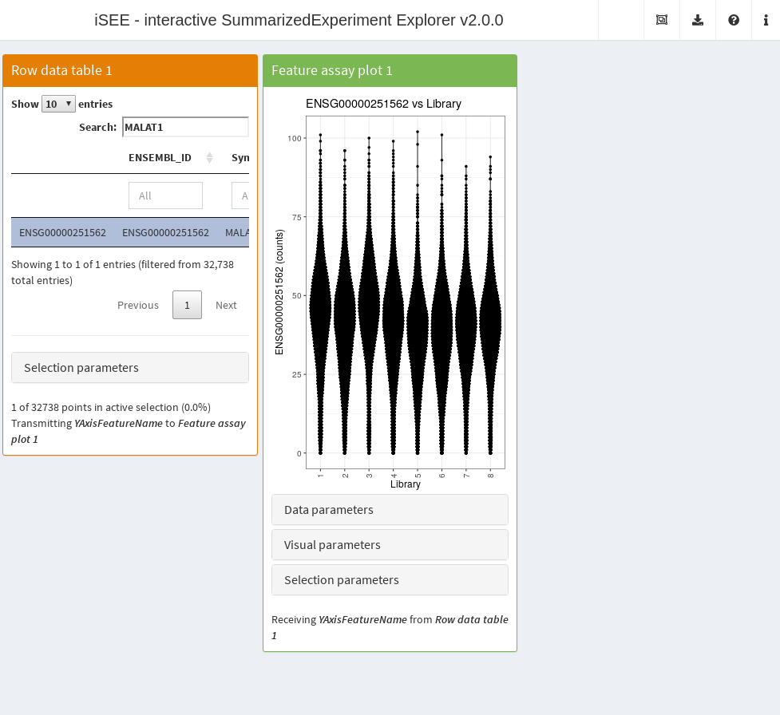
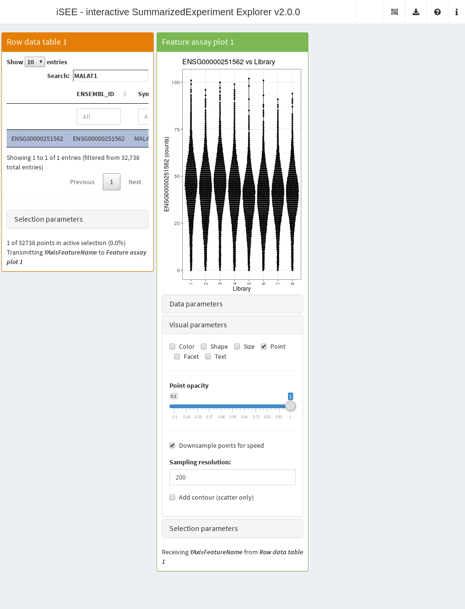
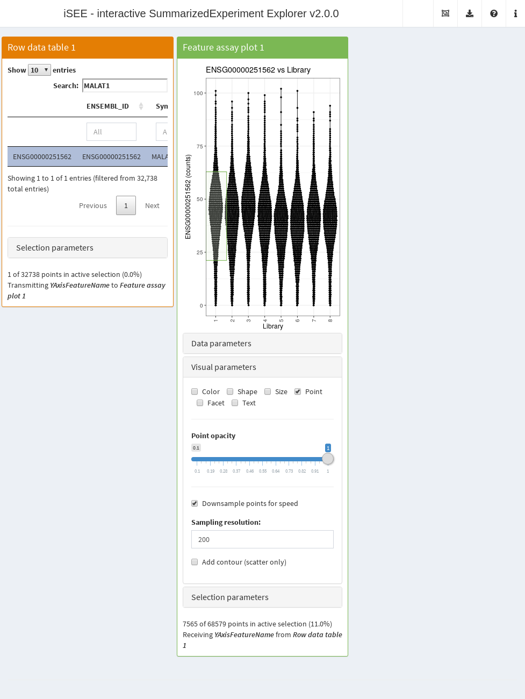

# How to use iSEE with big data

**Compiled date**: 2026-07-09

**Last edited**: 2018-03-08

**License**: MIT + file LICENSE

## Overview

Some tweaks can be performed to enable
*[iSEE](https://bioconductor.org/packages/3.23/iSEE)* to run efficiently
on large datasets. This includes datasets with many features
(methylation, SNPs) or many columns (cytometry, single-cell RNA-seq). To
demonstrate some of this functionality, we will use a dataset from the
*[TENxPBMCData](https://bioconductor.org/packages/3.23/TENxPBMCData)*
dataset:

``` r

library(TENxPBMCData)
sce.pbmc <- TENxPBMCData("pbmc68k")
sce.pbmc$Library <- factor(sce.pbmc$Library)
sce.pbmc
#> class: SingleCellExperiment 
#> dim: 32738 68579 
#> metadata(0):
#> assays(1): counts
#> rownames(32738): ENSG00000243485 ENSG00000237613 ... ENSG00000215616
#>   ENSG00000215611
#> rowData names(3): ENSEMBL_ID Symbol_TENx Symbol
#> colnames: NULL
#> colData names(11): Sample Barcode ... Individual Date_published
#> reducedDimNames(0):
#> mainExpName: NULL
#> altExpNames(0):
```

## Using out-of-memory matrices

Many `SummarizedExperiment` objects store assay matrices as in-memory
matrix-like objects, be they ordinary matrices or alternative
representations such as sparse matrices from the
*[Matrix](https://CRAN.R-project.org/package=Matrix)* package. For
example, if we looked at the Allen data, we would see that the counts
are stored as an ordinary matrix.

``` r

library(scRNAseq)
sce.allen <- ReprocessedAllenData("tophat_counts")
class(assay(sce.allen, "tophat_counts"))
#> [1] "matrix" "array"
```

In situations involving large datasets and limited computational
resources, storing the entire assay in memory may not be feasible.
Rather, we can represent the data as a file-backed matrix where contents
are stored on disk and retrieved on demand. Within the Bioconductor
ecosystem, the easiest way of doing this is to create a `HDF5Matrix`,
which uses a [HDF5
file](https://support.hdfgroup.org/HDF5/whatishdf5.html) to store all
the assay data. We see that this has already been done for use in the
68K PBMC dataset:

``` r

counts(sce.pbmc, withDimnames=FALSE)
#> <32738 x 68579> sparse HDF5Matrix object of type "integer":
#>              [,1]     [,2]     [,3]     [,4] ... [,68576] [,68577] [,68578]
#>     [1,]        0        0        0        0   .        0        0        0
#>     [2,]        0        0        0        0   .        0        0        0
#>     [3,]        0        0        0        0   .        0        0        0
#>     [4,]        0        0        0        0   .        0        0        0
#>     [5,]        0        0        0        0   .        0        0        0
#>      ...        .        .        .        .   .        .        .        .
#> [32734,]        0        0        0        0   .        0        0        0
#> [32735,]        0        0        0        0   .        0        0        0
#> [32736,]        0        0        0        0   .        0        0        0
#> [32737,]        0        0        0        0   .        0        0        0
#> [32738,]        0        0        0        0   .        0        0        0
#>          [,68579]
#>     [1,]        0
#>     [2,]        0
#>     [3,]        0
#>     [4,]        0
#>     [5,]        0
#>      ...        .
#> [32734,]        0
#> [32735,]        0
#> [32736,]        0
#> [32737,]        0
#> [32738,]        0
```

Despite the dimensions of this matrix, the `HDF5Matrix` object occupies
very little space in memory.

``` r

object.size(counts(sce.pbmc, withDimnames=FALSE))
#> 2496 bytes
```

However, parts of the data can still be read in on demand. For all
intents and purposes, the `HDF5Matrix` appears to be an ordinary matrix
to downstream applications and can be used as such.

``` r

first.gene <- counts(sce.pbmc)[1,]
head(first.gene)
#> [1] 0 0 0 0 0 0
```

This means that we can use the 68K PBMC `SingleCellExperiment` object in
[`iSEE()`](https://isee.github.io/iSEE/reference/iSEE.md) without any
extra work. The app below shows the distribution of counts for
everyone’s favorite gene *MALAT1* across libraries. Here,
[`iSEE()`](https://isee.github.io/iSEE/reference/iSEE.md) is simply
retrieving data on demand from the `HDF5Matrix` without ever loading the
entire assay matrix into memory. This enables it to run efficiently on
arbitrary large datasets with limited resources.

``` r

library(iSEE)
app <- iSEE(sce.pbmc, initial=
    list(RowDataTable(Selected="ENSG00000251562", Search="MALAT1"), 
        FeatureAssayPlot(XAxis="Column data", XAxisColumnData="Library",
            YAxisFeatureSource="RowDataTable1")
    )
)
```



Generally speaking, these HDF5 files are written once by a process with
sufficient computational resources (i.e., memory and time). We typically
create `HDF5Matrix` objects using the
[`writeHDF5Array()`](https://rdrr.io/pkg/HDF5Array/man/writeHDF5Array.html)
function from the
*[HDF5Array](https://bioconductor.org/packages/3.23/HDF5Array)* package.
After the file is created, the objects can be read many times in more
deprived environments.

``` r

sce.h5 <- sce.allen
library(HDF5Array)
assay(sce.h5, "tophat_counts", withDimnames=FALSE)  <- 
    writeHDF5Array(assay(sce.h5, "tophat_counts"), file="assay.h5", name="counts")
class(assay(sce.h5, "tophat_counts", withDimnames=FALSE))
#> [1] "HDF5Matrix"
#> attr(,"package")
#> [1] "HDF5Array"
list.files("assay.h5")
#> character(0)
```

It is worth noting that
[`iSEE()`](https://isee.github.io/iSEE/reference/iSEE.md) does not know
or care that the data is stored in a HDF5 file. The app is fully
compatible with any matrix-like representation of the assay data that
supports [`dim()`](https://rdrr.io/r/base/dim.html) and `[,`. As such,
[`iSEE()`](https://isee.github.io/iSEE/reference/iSEE.md) can be
directly used with other memory-efficient objects like the
`DeferredMatrix` and `LowRankMatrix` from the
*[BiocSingular](https://bioconductor.org/packages/3.23/BiocSingular)*
package, or perhaps the `ResidualMatrix` from the
*[batchelor](https://bioconductor.org/packages/3.23/batchelor)* package.

## Downsampling points

It is also possible to downsample points to reduce the time required to
generate the plot. This involves subsetting the dataset so that only the
most recently plotted point for an overlapping set of points is shown.
In this manner, we avoid wasting time in plotting many points that would
not be visible anyway. To demonstrate, we will re-use the 68K PBMC
example and perform downsampling on the feature assay plot; we can see
that its aesthetics are largely similar to the non-downsampled
counterpart above.

``` r

library(iSEE)
app <- iSEE(sce.pbmc, initial=
    list(RowDataTable(Selected="ENSG00000251562", Search="MALAT1"), 
        FeatureAssayPlot(XAxis="Column data", XAxisColumnData="Library",
            YAxisFeatureSource="RowDataTable1", 
            VisualChoices="Point", Downsample=TRUE,
            VisualBoxOpen=TRUE
        )
    )
)
```



Downsampling is possible in all
[`iSEE()`](https://isee.github.io/iSEE/reference/iSEE.md) plotting
panels that represent features or samples as points. We can turn on
downsampling for all such panels using the relevant field in
[`panelDefaults()`](https://isee.github.io/iSEE/reference/panelDefaults.md),
which spares us the hassle of setting `Downsample=` individually in each
panel constructor.

``` r

panelDefaults(Downsample=TRUE)
```

The downsampling only affects the visualization and the speed of the
plot rendering. Any interactions with other panels occur as if all of
the points were still there. For example, if one makes a brush, all of
the points therein will be selected regardless of whether they were
downsampled.



The downsampling resolution determines the degree to which points are
considered to be overlapping. Decreasing the resolution will downsample
more aggressively, improving plotting speed but potentially affecting
the fidelity of the visualization. This may compromise the aesthetics of
the plot when the size of the points is small, in which case an increase
in resolution may be required at the cost of speed.

Obviously, downsampling will not preserve overlays for partially
transparent points, but any reliance on partial transparency is probably
not a good idea in the first place when there are many points.

## Changing the interface

One can generally improve the speed of the
[`iSEE()`](https://isee.github.io/iSEE/reference/iSEE.md) interface by
only initializing the app with the desired panels. For example, it makes
little sense to spend time rendering a `RowDataPlot` when only the
`ReducedDimensionPlot` is of interest. Specification of the initial
state is straightforward with the `initial=` argument, as described in a
[previous
vignette](https://bioconductor.org/packages/3.23/iSEE/vignettes/configure.html).

On occasion, there may be alternative panels with more efficient
visualizations for the same data. The prime example is the
`ReducedDimensionHexPlot` class from the
*[iSEEu](https://bioconductor.org/packages/3.23/iSEEu)* package; this
will create a hexplot rather than a scatter plot, thus avoiding the need
to render each point in the latter.

## Comments on deployment

It is straightforward to host
*[iSEE](https://bioconductor.org/packages/3.23/iSEE)* applications on
hosting platforms like [Shiny
Server](https://rstudio.com/products/shiny/shiny-server/) or [Rstudio
Connect](https://rstudio.com/products/connect/). All one needs to do is
to create an `app.R` file that calls
[`iSEE()`](https://isee.github.io/iSEE/reference/iSEE.md) with the
desired parameters, and then follow the instructions for the target
platform. For a better user experience, we suggest setting a minimum
number of processes to avoid the initial delay from R start-up.

It is also possible to deploy and host Shiny app on
[shinyapps.io](https://www.shinyapps.io/), a platform as a service
(PaaS) provided by RStudio. In many cases, users will need to configure
the settings of their deployed apps, in particular selecting larger
instances to provide sufficient memory for the app. The maximum amount
of 1GB available to free accounts may not be sufficient to deploy large
datasets; in which case you may consider [using out-of-memory
matrices](#out-of-memory), filtering your dataset (e.g., removing lowly
detected features), or going for a paid account. Detailed instructions
to get started are available at
<https://shiny.rstudio.com/articles/shinyapps.html>. For example, see
the [isee-shiny-contest](https://rstudio.cloud/project/230765) app,
[winner of the 1st Shiny
Contest](https://blog.rstudio.com/2019/04/05/first-shiny-contest-winners/).

## Session Info

``` r

sessionInfo()
#> R version 4.6.1 (2026-06-24)
#> Platform: x86_64-pc-linux-gnu
#> Running under: Ubuntu 24.04.4 LTS
#> 
#> Matrix products: default
#> BLAS:   /usr/lib/x86_64-linux-gnu/openblas-pthread/libblas.so.3 
#> LAPACK: /usr/lib/x86_64-linux-gnu/openblas-pthread/libopenblasp-r0.3.26.so;  LAPACK version 3.12.0
#> 
#> locale:
#>  [1] LC_CTYPE=en_US.UTF-8       LC_NUMERIC=C              
#>  [3] LC_TIME=en_US.UTF-8        LC_COLLATE=en_US.UTF-8    
#>  [5] LC_MONETARY=en_US.UTF-8    LC_MESSAGES=en_US.UTF-8   
#>  [7] LC_PAPER=en_US.UTF-8       LC_NAME=C                 
#>  [9] LC_ADDRESS=C               LC_TELEPHONE=C            
#> [11] LC_MEASUREMENT=en_US.UTF-8 LC_IDENTIFICATION=C       
#> 
#> time zone: UTC
#> tzcode source: system (glibc)
#> 
#> attached base packages:
#> [1] stats4    stats     graphics  grDevices utils     datasets  methods  
#> [8] base     
#> 
#> other attached packages:
#>  [1] iSEE_2.23.1                 scRNAseq_2.26.0            
#>  [3] TENxPBMCData_1.30.0         HDF5Array_1.40.0           
#>  [5] h5mread_1.4.0               rhdf5_2.56.0               
#>  [7] DelayedArray_0.38.2         SparseArray_1.12.2         
#>  [9] S4Arrays_1.12.0             abind_1.4-8                
#> [11] Matrix_1.7-5                SingleCellExperiment_1.34.0
#> [13] SummarizedExperiment_1.42.0 Biobase_2.72.0             
#> [15] GenomicRanges_1.64.0        Seqinfo_1.2.0              
#> [17] IRanges_2.46.0              S4Vectors_0.50.1           
#> [19] BiocGenerics_0.58.1         generics_0.1.4             
#> [21] MatrixGenerics_1.24.0       matrixStats_1.5.0          
#> [23] BiocStyle_2.40.0           
#> 
#> loaded via a namespace (and not attached):
#>   [1] RColorBrewer_1.1-3       jsonlite_2.0.0           shape_1.4.6.1           
#>   [4] magrittr_2.0.5           GenomicFeatures_1.64.0   gypsum_1.8.0            
#>   [7] farver_2.1.2             rmarkdown_2.31           GlobalOptions_0.1.4     
#>  [10] fs_2.1.0                 BiocIO_1.22.0            ragg_1.5.2              
#>  [13] vctrs_0.7.3              memoise_2.0.1            Rsamtools_2.28.0        
#>  [16] RCurl_1.98-1.19          htmltools_0.5.9          AnnotationHub_4.2.2     
#>  [19] curl_7.1.0               Rhdf5lib_2.0.0           sass_0.4.10             
#>  [22] alabaster.base_1.12.1    bslib_0.11.0             htmlwidgets_1.6.4       
#>  [25] desc_1.4.3               alabaster.sce_1.12.0     fontawesome_0.5.3       
#>  [28] listviewer_4.0.0         httr2_1.2.3              cachem_1.1.0            
#>  [31] GenomicAlignments_1.48.0 igraph_2.3.3             mime_0.13               
#>  [34] lifecycle_1.0.5          iterators_1.0.14         pkgconfig_2.0.3         
#>  [37] colourpicker_1.3.0       R6_2.6.1                 fastmap_1.2.0           
#>  [40] shiny_1.14.0             clue_0.3-68              digest_0.6.39           
#>  [43] colorspace_2.1-2         AnnotationDbi_1.74.0     ExperimentHub_3.2.0     
#>  [46] textshaping_1.0.5        RSQLite_3.53.3           filelock_1.0.3          
#>  [49] mgcv_1.9-4               httr_1.4.8               compiler_4.6.1          
#>  [52] bit64_4.8.2              withr_3.0.3              doParallel_1.0.17       
#>  [55] S7_0.2.2                 BiocParallel_1.46.0      DBI_1.3.0               
#>  [58] shinyAce_0.4.4           alabaster.ranges_1.12.0  alabaster.schemas_1.12.0
#>  [61] rappdirs_0.3.4           rjson_0.2.23             tools_4.6.1             
#>  [64] vipor_0.4.7              otel_0.2.0               httpuv_1.6.17           
#>  [67] glue_1.8.1               restfulr_0.0.17          nlme_3.1-169            
#>  [70] promises_1.5.0           rhdf5filters_1.24.0      grid_4.6.1              
#>  [73] cluster_2.1.8.2          gtable_0.3.6             ensembldb_2.36.1        
#>  [76] XVector_0.52.0           ggrepel_0.9.8            BiocVersion_3.23.1      
#>  [79] foreach_1.5.2            pillar_1.11.1            later_1.4.8             
#>  [82] rintrojs_0.3.4           splines_4.6.1            circlize_0.4.18         
#>  [85] dplyr_1.2.1              BiocFileCache_3.2.0      lattice_0.22-9          
#>  [88] rtracklayer_1.72.0       bit_4.6.0                tidyselect_1.2.1        
#>  [91] ComplexHeatmap_2.28.0    miniUI_0.1.2             Biostrings_2.80.1       
#>  [94] knitr_1.51               bookdown_0.47            ProtGenerics_1.44.0     
#>  [97] shinydashboard_0.7.3     xfun_0.59                DT_0.34.0               
#> [100] UCSC.utils_1.8.0         lazyeval_0.2.3           yaml_2.3.12             
#> [103] shinyWidgets_0.9.1       evaluate_1.0.5           codetools_0.2-20        
#> [106] cigarillo_1.2.0          tibble_3.3.1             alabaster.matrix_1.12.0 
#> [109] BiocManager_1.30.27      cli_3.6.6                xtable_1.8-8            
#> [112] systemfonts_1.3.2        jquerylib_0.1.4          Rcpp_1.1.2              
#> [115] GenomeInfoDb_1.48.0      dbplyr_2.6.0             png_0.1-9               
#> [118] XML_3.99-0.23            parallel_4.6.1           ggplot2_4.0.3           
#> [121] pkgdown_2.2.1            blob_1.3.0               AnnotationFilter_1.36.0 
#> [124] bitops_1.0-9             viridisLite_0.4.3        alabaster.se_1.12.0     
#> [127] scales_1.4.0             purrr_1.2.2              crayon_1.5.3            
#> [130] GetoptLong_1.1.1         rlang_1.3.0              KEGGREST_1.52.2         
#> [133] shinyjs_2.1.1
# devtools::session_info()
```
