# Configuring iSEE apps

**Compiled date**: 2025-11-16

**Last edited**: 2020-04-20

**License**: MIT + file LICENSE

## Changing the default start configuration

The default start configuration with one plot of each type may not
always be the most appropriate. `iSEE` allows the user to
programmatically modify the initial settings (Rue-Albrecht et al. 2018),
avoiding the need to click through the choices to obtain the desired
panel setup. Almost every aspect of the initial app state can be
customized, down to whether or not the parameter boxes are open or
closed!

To demonstrate this feature, let’s assume that we are only interested in
*feature assay plot* panels. The default set of panels can be changed
via the `initialPanels` argument of the `iSEE` function call. Given a
`SingleCellExperiment` or `SummarizedExperiment` object named `sce`[^1],
the following code opens an app with two adjacent feature assay plots.
Note that each panel is set to occupy half the width of the application
window, which is set to 12 units by the
*[shiny](https://CRAN.R-project.org/package=shiny)* package.

``` r

library(iSEE)
app <- iSEE(sce, initial=list(
    FeatureAssayPlot(PanelWidth=6L),
    FeatureAssayPlot(PanelWidth=6L)
))
```

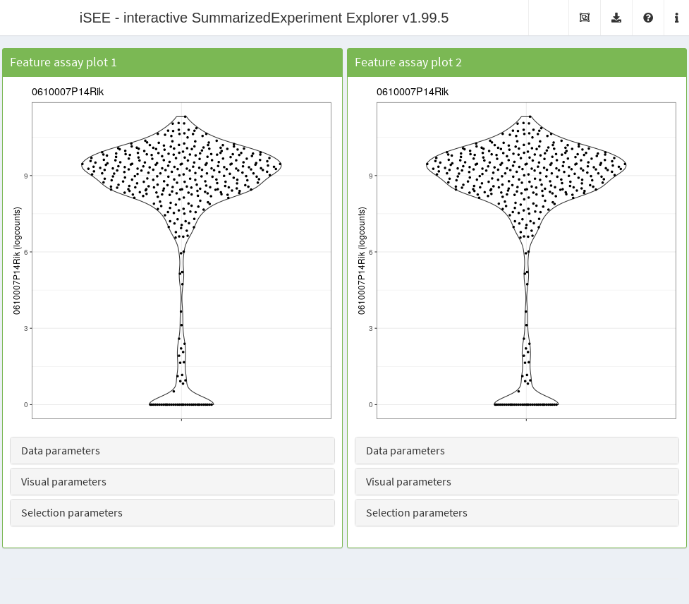

The genes to show on the Y-axis in the two plots can be specified via
the `YAxisFeatureName` argument to the respective panels in `iSEE`.

``` r

app <- iSEE(sce, initial=list(
    FeatureAssayPlot(YAxisFeatureName="0610009L18Rik"),
    FeatureAssayPlot(YAxisFeatureName="0610009B22Rik")
)) 
```

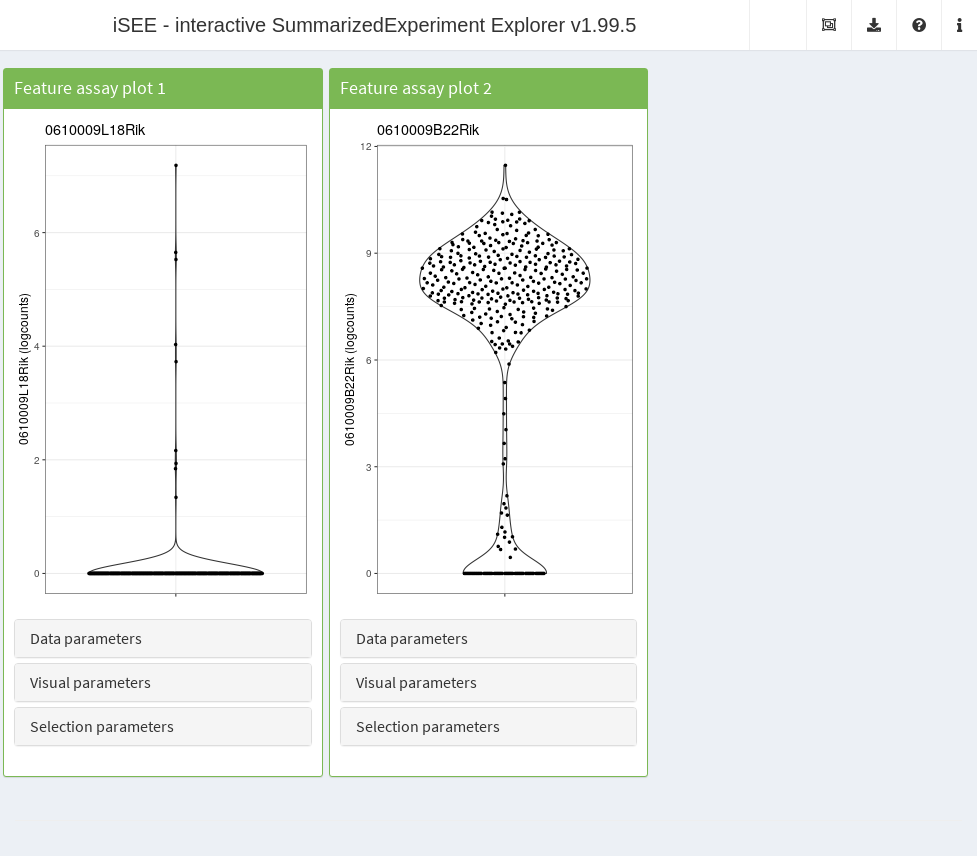

This will open the app with two feature assay plots, showing the
selected genes. Of course, from this starting point, all the interactive
functionality is still available, and new panels can be added, modified
and linked via point selection.

## Data parameters

### Overview

The *data parameters* control the source of the information represented
on the X-axis and Y-axis of each plot. Those parameters are accessible
at runtime in the eponymous collapsible box.

We refer users to the individual help page of each panel type listed
[below](#further) to learn more about the choices of X-axis variables
for each type of panel.

From a running `iSEE` application, you can also display all the R code
that is required to set up the current configuration by clicking on
`Display panel settings` under the export icon in the top-right corner.

### Setting the Y-axis

The nature of the Y-axis is defined by the type of panel. For instance,
*column data plot* panels require the name of a column in the
`colData(sce)`. Users can preconfigure the Y-axis of individual *column
data plot* panels as follows:

``` r

app <- iSEE(sce, initial=list(
    ColumnDataPlot(YAxis="NREADS", PanelWidth=6L, DataBoxOpen=TRUE),
    ColumnDataPlot(YAxis="TOTAL_DUP", PanelWidth=6L, DataBoxOpen=TRUE)
))
```

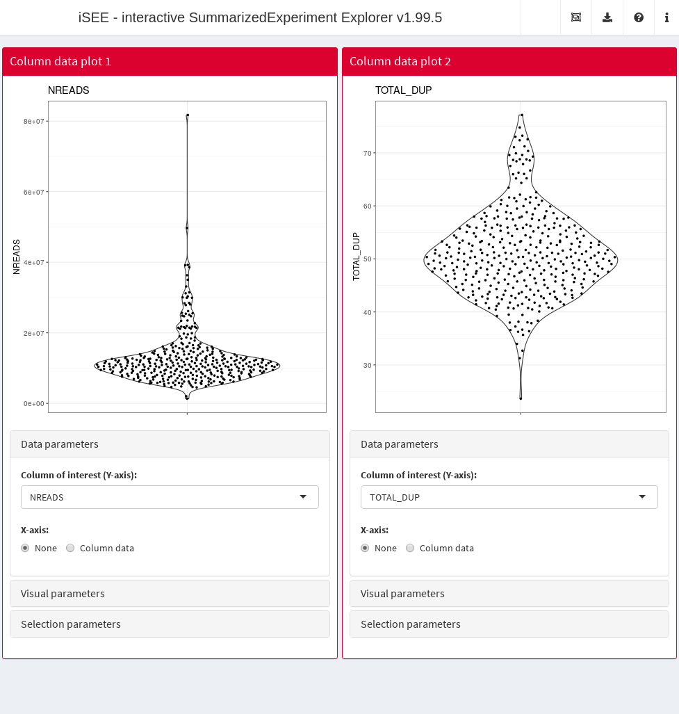

### Setting the X-axis

The X-axis can be set to different types of variables. The type of
variable is generally set in the `XAxis` slot, while the name of the
variable is stored in a different slot depending on the value of
`XAxis`. At runtime, this allows the app to remember the last selected
variable of each type.

For instance, the `XAxis` slot of the *feature assay plot* can have up
to four different values:

1.  `"None"`: does not require any addition input (draws a single violin
    for all features).
2.  `"Column data"`: requires `XAxisColumnData` to be set to a column
    name in the `colData(sce)`.
3.  `"Feature name"`: requires either
    1.  `XAxisFeatureName` to be set to a feature name (or positional
        index) in `rownames(sce)`.
    2.  `XAxisFeatureSource` to be set to the name of a *Row data table*
        panel with an active selection set in its own `Selected` column.

Each of these scenarios is demonstrated below:

``` r

fex <- FeatureAssayPlot(DataBoxOpen=TRUE, PanelWidth=6L)

# Example 1
fex1 <- fex
fex1[["XAxis"]] <- "None"

# Example 2
fex2 <- fex
fex2[["XAxis"]] <- "Column data"
fex2[["XAxisColumnData"]] <- "Core.Type"

# Example 3a
fex3 <- fex
fex3[["XAxis"]] <- "Feature name"
fex3[["XAxisFeatureName"]] <- "Zyx"

# Example 4 (also requires a row statistic table)
fex4 <- fex
fex4[["XAxis"]] <- "Feature name"
fex4[["XAxisFeatureSource"]] <- "RowDataTable1"
rex <- RowDataTable(Selected="Ints2", Search="Ints", PanelWidth=12L)

# Initialisation
app <- iSEE(sce, initial=list(fex1, fex2, fex3, fex4, rex))
```

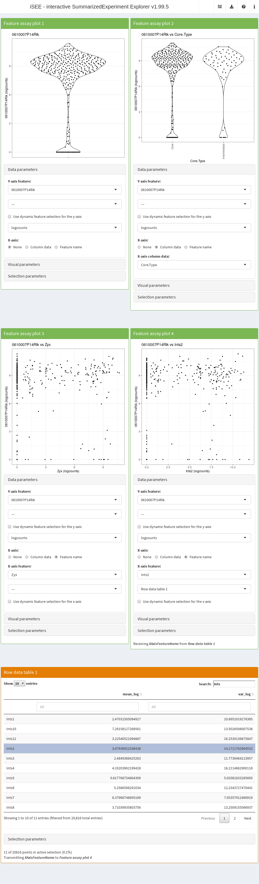

Note how *Example 3b* requires an active *row data table* as a source of
selection. To facilitate visualisation, we added the features
identifiers as the `gene_id` column in `rowData(sce)`, we preselected
the feature `"Ints2"`, and we prefiltered the table using the pattern
`"Ints"` on the `gene_id` column to show this active selection.

### Configuring the type of dimensionality reduction

In the case of reduced dimension plots, *data parameters* include the
name of the reduced dimension slot from which to fetch coordinates. This
information is stored in the `Type` slot:

``` r

app <- iSEE(sce, initial=list(
    ReducedDimensionPlot(DataBoxOpen=TRUE, Type="TSNE", 
        XAxis=2L, YAxis=1L, PanelWidth=6L)
))
```

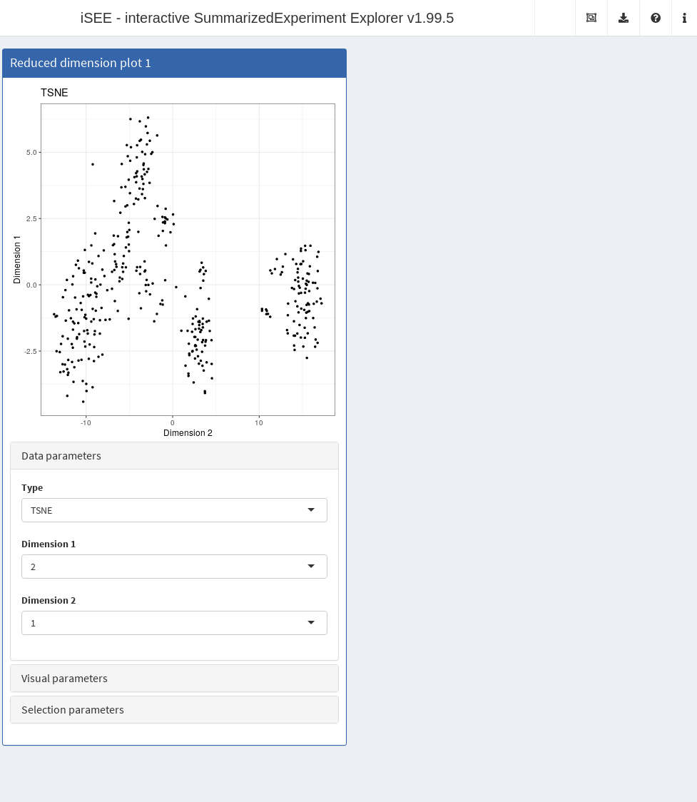

### Configuring the type of assay data

For axes linked to an assay, such as the Y-axis of *feature assay plot*
panels, the assay to display can be set through the `Assay` argument:

``` r

app <- iSEE(sce, initial=list(
    FeatureAssayPlot(DataBoxOpen=TRUE, Assay="logcounts", PanelWidth=6L),
    FeatureAssayPlot(DataBoxOpen=TRUE, Assay="tophat_counts", PanelWidth=6L)
))
```

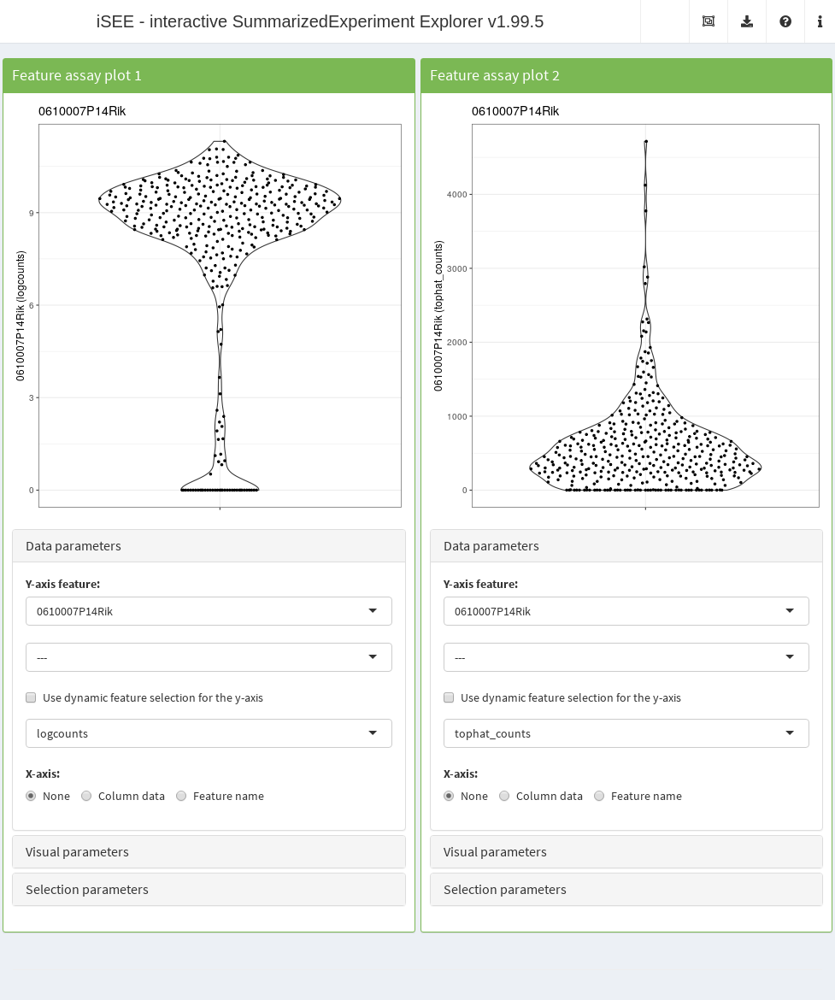

## Visual parameters

### Overview

The *visual parameters* control the appearance of data points. Those
parameters include: color, shape, size, opacity, facet, as well as font
size and legend position. Some visual parameters can be associated to
variables and controlled through
*[ggplot2](https://CRAN.R-project.org/package=ggplot2)* aesthetics,
while others can be set to constant user-defined values. All those
parameters are accessible at runtime in the eponymous collapsible box.

We refer users to the `?"iSEE point parameters"` help page to learn more
about the visual parameters variables configurable for each type of
panel; and to the `?"iSEE selection parameters"` help page to learn more
about the choices of parameters that control the appearance of point
selections in receiver plot panels.

### Configuring default visual parameters

Certain visual parameters can be set to a constant user-defined value.
Those include: color, transparency (i.e., alpha), downsampling
resolution, as well as text font size and legend position.

For instance, the default color of data points in *column data plot*
panels can be set to a value different than the default `"black"`
through the `ColorByDefaultColor` slot, while the default transparency
value is controlled through the `PointAlpha` slot Here, we alter several
default visual parameters in the second panel:

``` r

cdp <- ColumnDataPlot(VisualBoxOpen=TRUE, 
    VisualChoices=c("Color", "Size", "Point", "Text"))

cdp2 <- cdp
cdp2[["ColorByDefaultColor"]] <- "chocolate3"
cdp2[["PointAlpha"]] <- 0.2
cdp2[["PointSize"]] <- 2
cdp2[["Downsample"]] <- TRUE
cdp2[["DownsampleResolution"]] <- 150
cdp2[["FontSize"]] <- 2

app <- iSEE(sce, initial=list(cdp, cdp2))
```

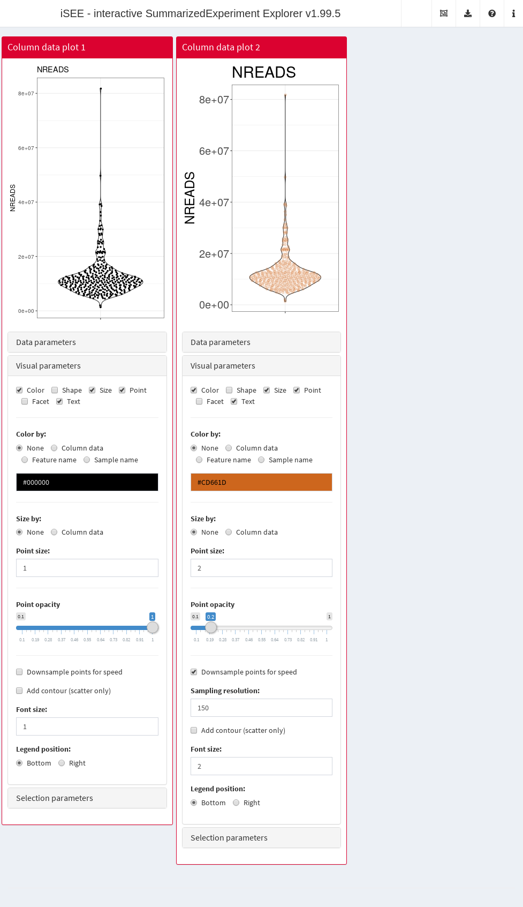

Note that for this demonstration, we facilitate visualization of the
preconfigured arguments by setting `VisualChoices` to display both the
`"Color"` and `"Shape"` UI panels.

### Linking point aesthetics to variables

The color and point of data points can be linked to variables in a
manner similar to the X-axis parameters demonstrated [above](#xaxis).

For instance, the color of data points in *column data plot* panels can
be set to a variable in `colData(sce)` by setting the `ColorBy` value to
`"Column data"`, and the `ColorByColumnData` value to the desired column
name:

``` r

cdp <- ColumnDataPlot(VisualBoxOpen=TRUE, VisualChoices=c("Color", "Shape"),
    ColorByColumnData="Core.Type", ShapeByColumnData="Core.Type",
    ColorBy="Column data", ShapeBy="Column data")

cdp2 <- cdp
cdp2[["ColorByColumnData"]] <- "TOTAL_DUP"
cdp2[["ShapeByColumnData"]] <- "driver_1_s"

app <- iSEE(sce, initial=list(cdp, cdp2))
```

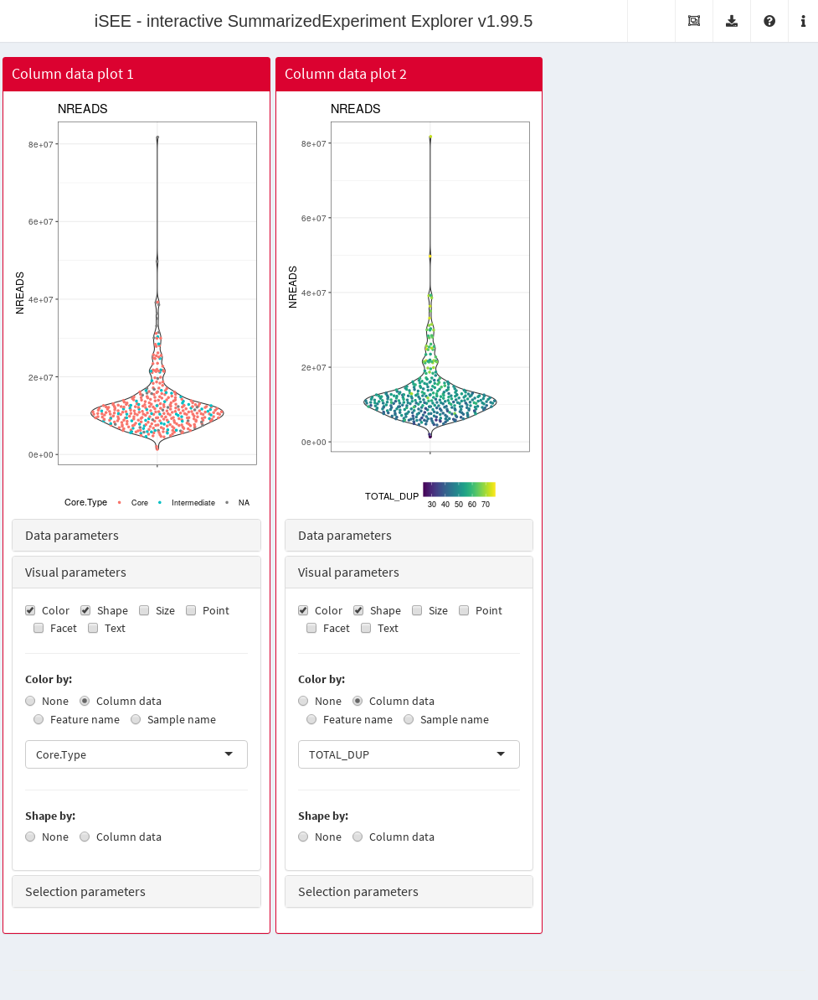

Note that points may only be shaped by a categorical variable.

### Configuring plot facets

Categorical variables may also be used to facet plots by row and column.
For instance, *column data plot* panels can be facet by variables stored
in the columns of `colData(sce)`. We demonstrate below how faceting may
be enabled by row, column, or both:

``` r

cdp <- ColumnDataPlot(VisualBoxOpen=TRUE, VisualChoices=c("Facet"),
    FacetRowBy="Column data", FacetRowByColData="driver_1_s", 
    FacetColumnBy="Column data", FacetColumnByColData="Core.Type", PanelWidth=4L)

cdp2 <- cdp
cdp2[["FacetRowBy"]] <- "None"

cdp3 <- cdp
cdp3[["FacetColumnBy"]] <- "None" 

app <- iSEE(sce, initial=list(cdp, cdp2, cdp3))
```

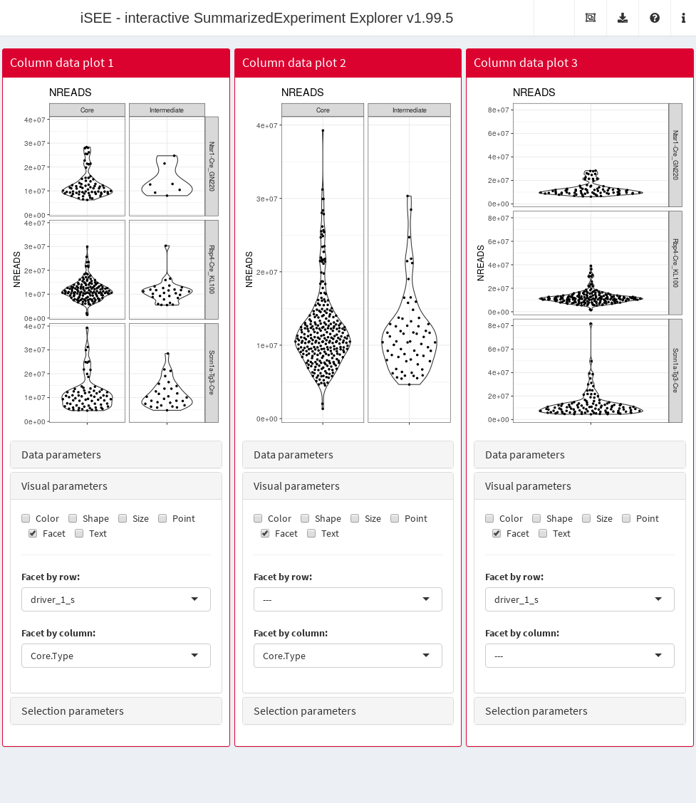

## Selection parameters

The initial state of *iSEE* applications can be configured all the way
down to point selections and links between panels. For instance, in the
example below, we preconfigure the `ColumnSelectionSource` column of a
*column data plot* panel to receive a point selection from a *reduced
dimension plot* panel. This requires an active selection in the *reduced
dimension plot* panel, which is achieved by preconfiguring the
`BrushData` slot.

The simplest way to obtain a valid `BrushData` value is to launch an
*iSEE* application, make the desired selection using a Shiny brush, open
the *iSEE* code tracker, and copy paste the relevant point selection
data. The result should look as below:

``` r

# Preconfigure the receiver panel
cdArgs <- ColumnDataPlot(
    XAxis="Column data",
    XAxisColumnData="driver_1_s",

    # Configuring the selection parameters.
    SelectionBoxOpen=TRUE,
    ColumnSelectionSource="ReducedDimensionPlot1",
    ColorBy="Column selection", 

    # Throwing in some parameters for aesthetic reasons.
    ColorByDefaultColor="#BDB3B3", 
    PointSize=2,
    PanelWidth=6L)

# Preconfigure the sender panel, including the point selection.
# NOTE: You don't actually have to write this from scratch! Just
# open an iSEE instance, make a brush and then look at the 'BrushData'
# entry when you click on the 'Display panel settings' button.
rdArgs <- ReducedDimensionPlot(
    BrushData = list(
        xmin = 13.7, xmax = 53.5, ymin = -36.5, ymax = 37.2, 
        coords_css = list(xmin = 413.2, xmax = 650.2, ymin = 83.0, ymax = 344.0), 
        coords_img = list(xmin = 537.2, xmax = 845.3, ymin = 107.9, ymax = 447.2), 
        img_css_ratio = list(x = 1.3, y = 1.3), 
        mapping = list(x = "X", y = "Y"), 
        domain = list(left = -49.1, right = 57.2, bottom = -70.4, top = 53.5), 
        range = list(left = 50.9, right = 873.9, bottom = 603.0, top = 33.1), 
        log = list(x = NULL, y = NULL), 
        direction = "xy", 
        brushId = "ReducedDimensionPlot1_Brush", 
        outputId = "ReducedDimensionPlot1"
    ),
    PanelWidth=6L
)    

app <- iSEE(sce, initial=list(cdArgs, rdArgs))
```

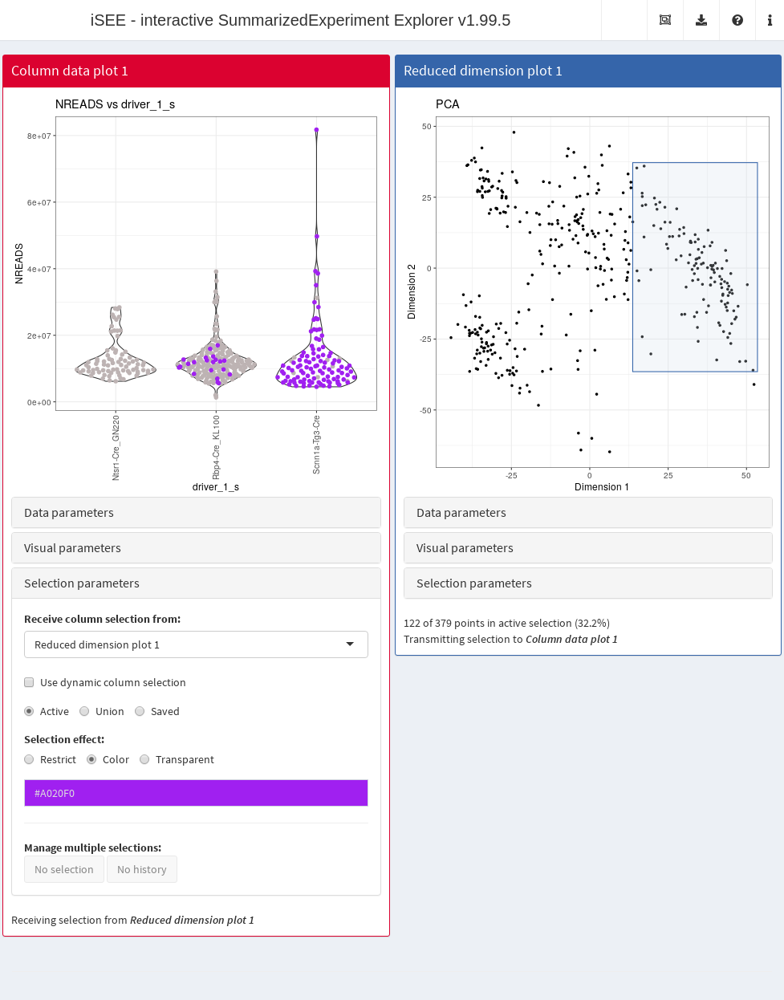

Note that in the example above, we color selected data points in the
receiver panel by setting the `ColorBy` argument to
`"Column selection"`. The default is to increase the transparency of
unselected data points; another option is to set
`ColumnSelectionRestrict` to `TRUE` to show only the selected data
points.

An identical process can be followed to preconfigure a lasso point
selection:

``` r

# Preconfigure the sender panel, including the point selection.
# NOTE: again, you shouldn't try writing this from scratch! Just
# make a lasso and then copy the panel settings in 'BrushData'.
rdArgs[["BrushData"]] <- list(
    lasso = NULL, closed = TRUE, panelvar1 = NULL, panelvar2 = NULL, 
    mapping = list(x = "X", y = "Y"), 
    coord = structure(c(18.4, 
        18.5, 26.1, 39.9, 
        55.2, 50.3, 54.3, 
        33.3, 18.4, 35.5, 
        -4.2, -21.2, -46.1, 
        -43.5, -18.1, 7.3, 
        19.7, 35.5), .Dim = c(9L, 2L)
    )
)

app <- iSEE(sce, initial=list(cdArgs, rdArgs))
```

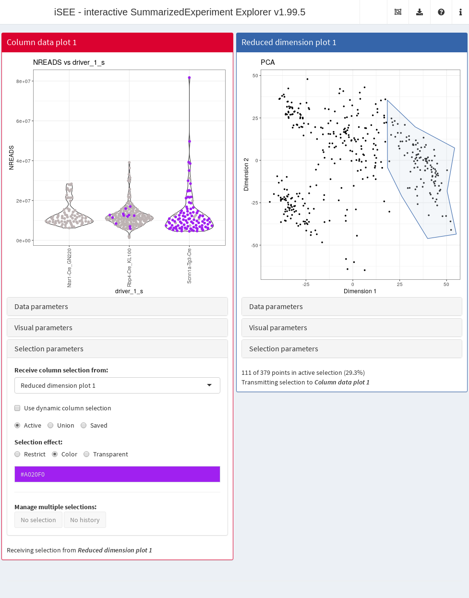

## Writing your own tour

By providing a data frame to the `tour` argument of `iSEE`, you can
create your own tour that will start when the app is launched[^2]. The
data frame should have two columns, `element` and `intro`:

``` r

introtour <- defaultTour()
head(introtour)
#>                                            element
#> 1                                         #Welcome
#> 2                                       #allpanels
#> 3                           #ReducedDimensionPlot1
#> 4               #ReducedDimensionPlot1_DataBoxOpen
#> 5 #ReducedDimensionPlot1_Type + .selectize-control
#> 6                           #ReducedDimensionPlot1
#>                                                                                                                                                                                                                                                                                                                                                                                                                                                                                                                                                                                                                                                                                                                                   intro
#> 1 Welcome to the interactive tour for iSEE - the Interactive SummarizedExperiment Explorer.<br/><br/>You will be shown around the different components of iSEE and learn the basic usage mechanisms by doing. Highlighted elements will respond to the user's actions, while the rest of the UI will be shaded. You will be prompted at particular spots to perform some actions, which will be marked with "<strong>Action:</strong>" text. Please take care to follow these instructions, since later parts of the tour may assume that all the actions from previous steps have been performed.<br/><br/><strong>Action:</strong> now, click on the 'Next' button or use the right arrow of your keyboard to proceed into your tour.
#> 2    iSEE provides a Shiny interface that allows you to generate a series of panels for exploring <code>SummarizedExperiment</code> objects. Here, we use single-cell RNA sequencing data from the <a href="https://doi.org/doi:10.18129/B9.bioc.scRNAseq"><i>scRNAseq</i> package</a>, specifically a subset of gene expression profiles from cells in the mouse visual cortex <a href="https://doi.org/10.1038/nn.4216">(Tasic <i>et al.</i>, 2016)</a>. Each column of the <code>SummarizedExperiment</code> corresponds to a cell, while each row corresponds to a gene.<br/><br/>Using iSEE, you can generate a variety of different panel types to visualize the data. These are described in more detail in the following steps.
#> 3                                                                                                                                                                                                                                                                                                                                                                                                                                                                                                          For example, you can construct a <font color="#402ee8">Reduced dimension plot</font> to visualize a low-dimensional representation (e.g., PCA, <i>t</i>-SNE) of our dataset of interest. Here, each point represents a cell.
#> 4                                                                                                                                                                                                                                                                                                                 For each plot panel, a variety of parameters are available to control the appearance and behaviour of the plot. These parameters are located in these collapsible boxes, such as the <font color="#402ee8">Data parameters</font> box that contains parameters related to the type of data being shown.<br /><br /><strong>Action:</strong> click on the header of this collapsible box to see the available options.
#> 5                                                                                                                                                                                                                                                                                                                                                                                                                                                                                                                                                                                                                     <strong>Action:</strong> change this to <code>TSNE</code> to see the two-dimensional <i>t</i>-SNE representation.
#> 6                                                                                                                                                                                                                                                                                                                                                                                                                                                                                                                                                                                                                                      You can see how the panel immediately switched to the requested dimensionality reduction result.
```

Each entry of the `element` column contains the name of a UI element in
the application, prefixed by a hash sign (`#`). The `intro` column
contains the corresponding text (or basic HTML) that is to be shown at
each step.

The simplest way to get started is to save the output of
[`defaultTour()`](https://isee.github.io/iSEE/reference/defaultTour.md)
to a text file and edit it for your specific data set. More customized
tours require some knowledge of the names of the UI elements to put in
the `element` column. We recommend one of the following options:

- If using Firefox, open the `Tools` menu. Select `Web Developer`, and
  in the submenu, select `Inspector`. This will toggle a toolbar, and
  you will be able to read out the name of the element of interest when
  you hover and click on it. If you want to select another element, you
  might need to re-click on the icon in the upper left corner of the
  toolbox, `Pick an element from the page`.
- If using Safari, open the `Develop` menu and select
  `Show Web Inspector`. To toggle the selection of elements, you need to
  click on the crosshair icon in the top part of the toolbox, then
  again, explore the desired element by clicking or hovering on it.
- If using Chrome, from the `View` menu, select first `Developer` and
  then `Developer Tools`. Click then on the selecting arrow in the top
  left corner, and similarly to the other browsers, hover or click on
  the element of interest to obtain its name.
- Alternatively, the [SelectorGadget](https://selectorgadget.com)
  browser extension can be used.

Most elements can be identified using the above strategies. Selectize
widgets are trickier but can be handled with, e.g.,
`#ComplexHeatmapPlot1_ColumnData + .selectize-control`. Please see the
`intro_firststeps.txt` file in the `inst/extdata` folder for more of
these examples.

Sometimes it is useful to place one step of the tour in the center. To
do so, simply put a hash sign before a word which does not link directly
to any CSS selector (e.g., as we do for `#Welcome`) in the corresponding
`element` column.

## Further reading

Users should refer to the following help pages for the full list of
values that can be specified in `iSEE`:

- [`?ReducedDimensionPlot`](https://isee.github.io/iSEE/reference/ReducedDimensionPlot-class.md)
- [`?ColumnDataPlot`](https://isee.github.io/iSEE/reference/ColumnDataPlot-class.md)
- [`?ColumnDataTable`](https://isee.github.io/iSEE/reference/ColumnDataTable-class.md)
- [`?FeatureAssayPlot`](https://isee.github.io/iSEE/reference/FeatureAssayPlot-class.md)
- [`?RowDataPlot`](https://isee.github.io/iSEE/reference/RowDataPlot-class.md)
- [`?RowDataTable`](https://isee.github.io/iSEE/reference/RowDataTable-class.md)
- [`?SampleAssayPlot`](https://isee.github.io/iSEE/reference/SampleAssayPlot-class.md)
- [`?ComplexHeatmapPlot`](https://isee.github.io/iSEE/reference/ComplexHeatmapPlot-class.md)

Some fairly complex configurations for a variety of data sets can be
found at <https://github.com/iSEE/iSEE2018>. These may serve as useful
examples for setting up your own configurations.

## Session Info

``` r

sessionInfo()
#> R Under development (unstable) (2025-11-12 r89009)
#> Platform: x86_64-pc-linux-gnu
#> Running under: Ubuntu 24.04.3 LTS
#> 
#> Matrix products: default
#> BLAS:   /usr/lib/x86_64-linux-gnu/openblas-pthread/libblas.so.3 
#> LAPACK: /usr/lib/x86_64-linux-gnu/openblas-pthread/libopenblasp-r0.3.26.so;  LAPACK version 3.12.0
#> 
#> locale:
#>  [1] LC_CTYPE=en_US.UTF-8       LC_NUMERIC=C              
#>  [3] LC_TIME=en_US.UTF-8        LC_COLLATE=en_US.UTF-8    
#>  [5] LC_MONETARY=en_US.UTF-8    LC_MESSAGES=en_US.UTF-8   
#>  [7] LC_PAPER=en_US.UTF-8       LC_NAME=C                 
#>  [9] LC_ADDRESS=C               LC_TELEPHONE=C            
#> [11] LC_MEASUREMENT=en_US.UTF-8 LC_IDENTIFICATION=C       
#> 
#> time zone: UTC
#> tzcode source: system (glibc)
#> 
#> attached base packages:
#> [1] stats4    stats     graphics  grDevices utils     datasets  methods  
#> [8] base     
#> 
#> other attached packages:
#>  [1] iSEE_2.23.1                 SingleCellExperiment_1.33.0
#>  [3] SummarizedExperiment_1.41.0 Biobase_2.71.0             
#>  [5] GenomicRanges_1.63.0        Seqinfo_1.1.0              
#>  [7] IRanges_2.45.0              S4Vectors_0.49.0           
#>  [9] BiocGenerics_0.57.0         generics_0.1.4             
#> [11] MatrixGenerics_1.23.0       matrixStats_1.5.0          
#> [13] BiocStyle_2.39.0           
#> 
#> loaded via a namespace (and not attached):
#>  [1] rlang_1.1.6           magrittr_2.0.4        shinydashboard_0.7.3 
#>  [4] clue_0.3-66           GetoptLong_1.0.5      otel_0.2.0           
#>  [7] compiler_4.6.0        mgcv_1.9-4            png_0.1-8            
#> [10] systemfonts_1.3.1     vctrs_0.6.5           pkgconfig_2.0.3      
#> [13] shape_1.4.6.1         crayon_1.5.3          fastmap_1.2.0        
#> [16] XVector_0.51.0        fontawesome_0.5.3     promises_1.5.0       
#> [19] rmarkdown_2.30        shinyAce_0.4.4        ragg_1.5.0           
#> [22] xfun_0.54             cachem_1.1.0          jsonlite_2.0.0       
#> [25] listviewer_4.0.0      later_1.4.4           DelayedArray_0.37.0  
#> [28] parallel_4.6.0        cluster_2.1.8.1       R6_2.6.1             
#> [31] bslib_0.9.0           RColorBrewer_1.1-3    jquerylib_0.1.4      
#> [34] Rcpp_1.1.0            bookdown_0.45         iterators_1.0.14     
#> [37] knitr_1.50            httpuv_1.6.16         Matrix_1.7-4         
#> [40] splines_4.6.0         igraph_2.2.1          tidyselect_1.2.1     
#> [43] abind_1.4-8           yaml_2.3.10           doParallel_1.0.17    
#> [46] codetools_0.2-20      miniUI_0.1.2          lattice_0.22-7       
#> [49] tibble_3.3.0          shiny_1.11.1          S7_0.2.1             
#> [52] evaluate_1.0.5        desc_1.4.3            circlize_0.4.16      
#> [55] pillar_1.11.1         BiocManager_1.30.27   DT_0.34.0            
#> [58] foreach_1.5.2         shinyjs_2.1.0         ggplot2_4.0.1        
#> [61] scales_1.4.0          xtable_1.8-4          glue_1.8.0           
#> [64] tools_4.6.0           colourpicker_1.3.0    fs_1.6.6             
#> [67] grid_4.6.0            colorspace_2.1-2      nlme_3.1-168         
#> [70] vipor_0.4.7           cli_3.6.5             textshaping_1.0.4    
#> [73] viridisLite_0.4.2     S4Arrays_1.11.0       ComplexHeatmap_2.27.0
#> [76] dplyr_1.1.4           gtable_0.3.6          rintrojs_0.3.4       
#> [79] sass_0.4.10           digest_0.6.38         SparseArray_1.11.1   
#> [82] ggrepel_0.9.6         rjson_0.2.23          htmlwidgets_1.6.4    
#> [85] farver_2.1.2          memoise_2.0.1         htmltools_0.5.8.1    
#> [88] pkgdown_2.2.0         lifecycle_1.0.4       shinyWidgets_0.9.0   
#> [91] GlobalOptions_0.1.2   mime_0.13
# devtools::session_info()
```

## References

Rue-Albrecht, K., F. Marini, C. Soneson, and A. T. L. Lun. 2018. “iSEE:
Interactive SummarizedExperiment Explorer.” *F1000Research* 7 (June):
741.

[^1]: We’ll re-use the example from the [previous
    workflow](https://bioconductor.org/packages/3.23/iSEE/vignettes/basic.html).

[^2]: In theory. On servers, sometimes the tour does not recognize the
    UI elements at start-up and needs to be restarted via the “Click me
    for quick tour” button to work properly.
