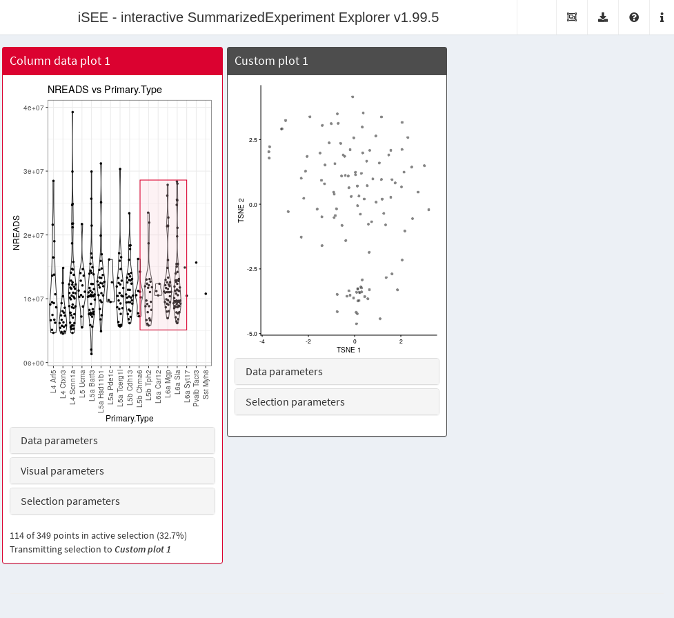
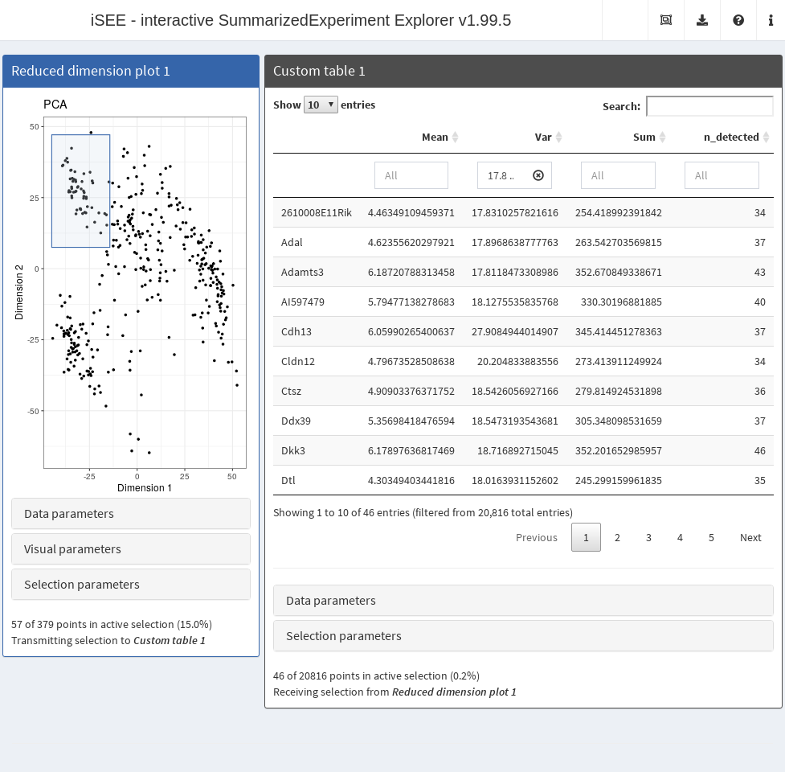
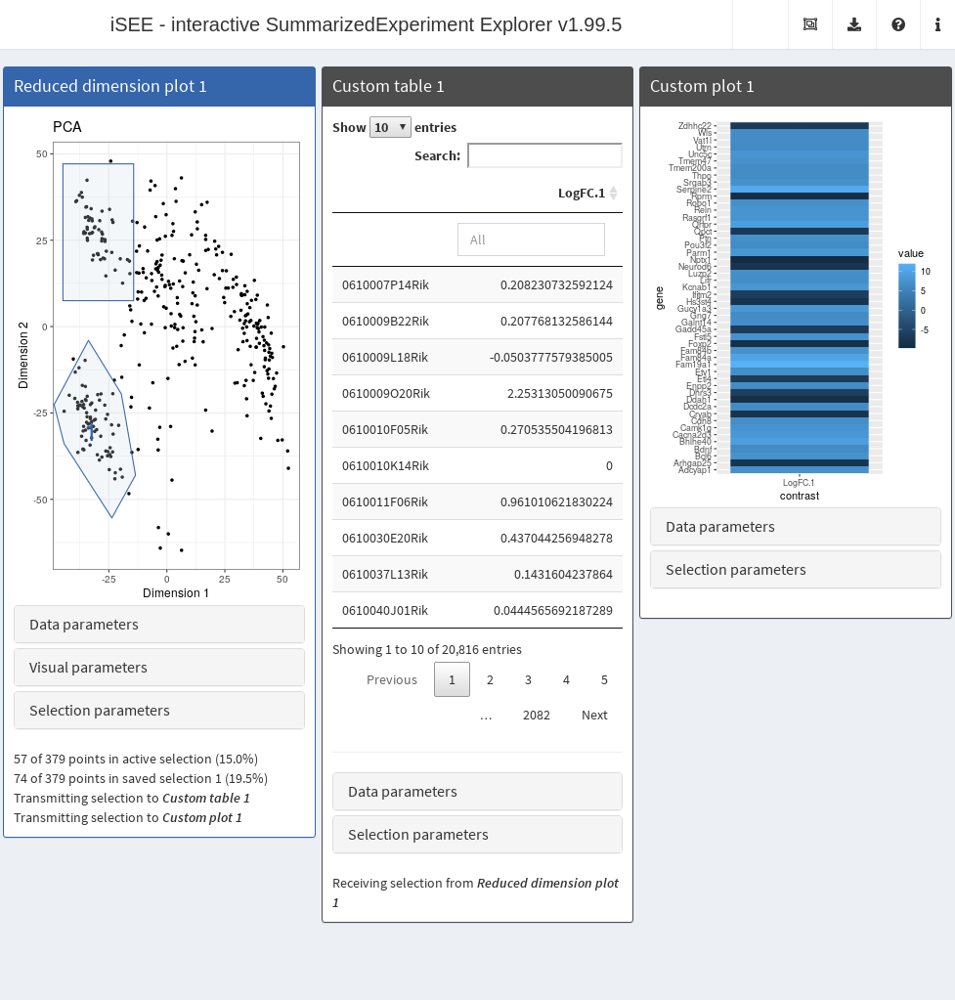

# Deploying custom panels in the iSEE interface

**Compiled date**: 2026-07-09

**Last edited**: 2020-04-20

**License**: MIT + file LICENSE

## Background

Users can define their own custom plots or tables to include in the
`iSEE` interface (Rue-Albrecht et al. 2018). These custom panels are
intended to receive subsets of rows and/or columns from other
transmitting panels in the interface. The values in the custom panels
are then recomputed on the fly by user-defined functions using the
transmitted subset. This provides a flexible and convenient framework
for lightweight interactive analysis during data exploration. For
example, selection of a particular subset of samples can be transmitted
to a custom plot panel that performs dimensionality reduction on that
subset. Alternatively, the subset can be transmitted to a custom table
that performs a differential expression analysis between that subset and
all other samples.

## Defining custom functions

### Minimum requirements

Recalculations in custom panels are performed using user-defined
functions that are supplied to the
[`iSEE()`](https://isee.github.io/iSEE/reference/iSEE.md) call. The only
requirements are that the function must accept:

- A `SummarizedExperiment` object or its derivatives as the first
  argument.
- A list of character vectors containing row names as the *second*
  argument. Each vector specifies the rows that are currently selected
  in the transmitting *row-based* panel, as an active selection or as
  one of the saved selection. This may be `NULL` if no transmitting
  panel was selected or if no selections are available.
- A list of character vectors containing column names as the *third*
  argument. Each vector specifies the columns that are currently
  selected in the transmitting *column-based* panel, as an active
  selection or as one of the saved selection. This may be `NULL` if no
  transmitting panel was selected or if no selections are available.

The output of the function should be:

- A `ggplot` object for functions used in *custom plot panels*.
- A `data.frame` for functions used in *custom table panels*.

### Example of custom plot panel

To demonstrate the use of *custom plot panels*, we define an example
function `CUSTOM_DIMRED` that takes a subset of features and cells in a
`SingleCellExperiment` object and performs dimensionality reduction on
that subset with
*[scater](https://bioconductor.org/packages/3.23/scater)* function
(McCarthy et al. 2017).

``` r

library(scater)
CUSTOM_DIMRED <- function(se, rows, columns, ntop=500, scale=TRUE,
    mode=c("PCA", "TSNE", "UMAP"))
{
    print(columns)
    if (is.null(columns)) {
        return(
            ggplot() + theme_void() + geom_text(
                aes(x, y, label=label),
                data.frame(x=0, y=0, label="No column data selected."),
                size=5)
            )
    }

    mode <- match.arg(mode)
    if (mode=="PCA") {
        calcFUN <- runPCA
    } else if (mode=="TSNE") {
        calcFUN <- runTSNE
    } else if (mode=="UMAP") {
        calcFUN <- runUMAP
    }

    set.seed(1000)
    kept <- se[, unique(unlist(columns))]
    kept <- calcFUN(kept, ncomponents=2, ntop=ntop,
        scale=scale, subset_row=unique(unlist(rows)))
    plotReducedDim(kept, mode)
}
```

As mentioned above, `rows` and `columns` may be `NULL` if no selection
was made in the respective transmitting panels. How these should be
treated is up to the user-defined function. In this example, an empty
*ggplot* is returned if there is no selection on the columns, while the
default behaviour of `runPCA`, `runTSNE`, etc. is used if `rows=NULL`.

To create instances of our panel, we call the
[`createCustomPlot()`](https://isee.github.io/iSEE/reference/createCustomPanels.md)
function with `CUSTOM_DIMRED` to set up the custom plot class and its
methods. This returns a constructor function that can be directly used
to generate an instance of our custom plot.

``` r

library(iSEE)
GENERATOR <- createCustomPlot(CUSTOM_DIMRED)
custom_panel <- GENERATOR()
class(custom_panel)
#> [1] "CustomPlot"
#> attr(,"package")
#> [1] ".GlobalEnv"
```

We can now easily supply instances of our new custom plot class to
[`iSEE()`](https://isee.github.io/iSEE/reference/iSEE.md) like any other
`Panel` instance. The example below creates an application where a
column data plot transmits a selection to our custom plot, the latter of
which is initialized in $`t`$-SNE mode with the top 1000 most variable
genes.

``` r

# NOTE: as mentioned before, you don't have to create 'BrushData' manually;
# just open an app, make a brush and copy it from the panel settings.
cdp <- ColumnDataPlot(
    XAxis="Column data", 
    XAxisColumnData="Primary.Type", 
    PanelId=1L,
    BrushData=list(
        xmin = 10.1, xmax = 15.0, ymin = 5106720.6, ymax = 28600906.0, 
        coords_css = list(xmin = 271.0, xmax = 380.0, ymin = 143.0, ymax = 363.0), 
        coords_img = list(xmin = 352.3, xmax = 494.0, ymin = 185.9, ymax = 471.9), 
        img_css_ratio = list(x = 1.3, y = 1.2), 
        mapping = list(x = "X", y = "Y", group = "GroupBy"),
        domain = list(
            left = 0.4, right = 17.6, bottom = -569772L, top = 41149532L, 
            discrete_limits = list(
                x = list("L4 Arf5", "L4 Ctxn3", "L4 Scnn1a", 
                    "L5 Ucma", "L5a Batf3", "L5a Hsd11b1", "L5a Pde1c", 
                    "L5a Tcerg1l", "L5b Cdh13", "L5b Chrna6", "L5b Tph2", 
                    "L6a Car12", "L6a Mgp", "L6a Sla", "L6a Syt17", 
                    "Pvalb Tacr3", "Sst Myh8")
            )
        ), 
        range = list(
            left = 68.986301369863, right = 566.922374429224, 
            bottom = 541.013698630137, top = 33.1552511415525
        ), 
        log = list(x = NULL, y = NULL), 
        direction = "xy", 
        brushId = "ColumnDataPlot1_Brush", 
        outputId = "ColumnDataPlot1"
    )
)

custom.p <- GENERATOR(mode="TSNE", ntop=1000, 
    ColumnSelectionSource="ColumnDataPlot1")

app <- iSEE(sce, initial=list(cdp, custom.p)) 
```



The most interesting aspect of
[`createCustomPlot()`](https://isee.github.io/iSEE/reference/createCustomPanels.md)
is that the UI elements for modifying the optional arguments in
`CUSTOM_DIMRED` are also automatically generated. This provides a
convenient way to generate a reasonably intuitive UI for rapid
prototyping, though there are limitations - see the documentation for
more details.

### Example of custom table panel

To demonstrate the use of *custom table panels*, we define an example
function `CUSTOM_SUMMARY` below. This takes a subset of features and
cells in a `SingleCellExperiment` object and creates dataframe that
details the `mean`, `variance` and count of samples with expression
above a given cut-off within the selection. If either `rows` or
`columns` are `NULL`, all rows or columns are used, respectively.

``` r

CUSTOM_SUMMARY <- function(se, ri, ci, assay="logcounts", min_exprs=0) {
    if (is.null(ri)) {
        ri <- rownames(se)
    } else {
        ri <- unique(unlist(ri))
    }
    if (is.null(ci)) {
        ci <- colnames(se)
    } else {
        ci <- unique(unlist(ci))
    }
    
    assayMatrix <- assay(se, assay)[ri, ci, drop=FALSE]
    
    data.frame(
        Mean = rowMeans(assayMatrix),
        Var = rowVars(assayMatrix),
        Sum = rowSums(assayMatrix),
        n_detected = rowSums(assayMatrix > min_exprs),
        row.names = ri
    )
}
```

To create instances of our panel, we call the
[`createCustomTable()`](https://isee.github.io/iSEE/reference/createCustomPanels.md)
function with `CUSTOM_SUMMARY`, which again returns a constructor
function that can be used directly in
[`iSEE()`](https://isee.github.io/iSEE/reference/iSEE.md). Again, the
function will attempt to auto-pick an appropriate UI element for each
optional argument in `CUSTOM_SUMMARY`.

``` r

library(iSEE)
GENERATOR <- createCustomTable(CUSTOM_SUMMARY)
custom.t <- GENERATOR(PanelWidth=8L,
    ColumnSelectionSource="ReducedDimensionPlot1",
    SearchColumns=c("", "17.8 ... 10000", "", "") # filtering for HVGs.
) 
class(custom.t)
#> [1] "CustomTable"
#> attr(,"package")
#> [1] ".GlobalEnv"

# Preselecting some points in the reduced dimension plot.
# Again, you don't have to manually create the 'BrushData'!
rdp <- ReducedDimensionPlot(
    PanelId=1L,
    BrushData = list(
        xmin = -44.8, xmax = -14.3, ymin = 7.5, ymax = 47.1, 
        coords_css = list(xmin = 55.0, xmax = 169.0, ymin = 48.0, ymax = 188.0),
        coords_img = list(xmin = 71.5, xmax = 219.7, ymin = 62.4, ymax = 244.4), 
        img_css_ratio = list(x = 1.3, y = 1.29), 
        mapping = list(x = "X", y = "Y"), 
        domain = list(left = -49.1, right = 57.2, bottom = -70.3, top = 53.5), 
        range = list(left = 50.9, right = 566.9, bottom = 603.0, top = 33.1), 
        log = list(x = NULL, y = NULL), 
        direction = "xy", 
        brushId = "ReducedDimensionPlot1_Brush", 
        outputId = "ReducedDimensionPlot1"
    )
)

app <- iSEE(sce, initial=list(rdp, custom.t))
```



## Handling active and saved selections

Recall that the second and third arguments are actually lists containing
both active and saved selections from the transmitter. More advanced
custom panels can take advantage of these multiple selections to perform
more sophisticated data processing. For example, we can write a function
that computes log-fold changes between the samples in the active
selection and the samples in each saved selection. (It would be trivial
to extend this to obtain actual differential expression statistics,
e.g., using `scran::findMarkers()` or functions from packages like
*[limma](https://bioconductor.org/packages/3.23/limma)*.)

``` r

CUSTOM_DIFFEXP <- function(se, ri, ci, assay="logcounts") {
    ri <- ri$active
    if (is.null(ri)) { 
        ri <- rownames(se)
    }
    assayMatrix <- assay(se, assay)[ri, , drop=FALSE]

    if (is.null(ci$active) || length(ci)<2L) {
        return(data.frame(row.names=character(0), LogFC=integer(0))) # dummy value.
    }
    active <- rowMeans(assayMatrix[,ci$active,drop=FALSE])

    all_saved <- ci[grep("saved", names(ci))]
    lfcs <- vector("list", length(all_saved))
    for (i in seq_along(lfcs)) {
        saved <- rowMeans(assayMatrix[,all_saved[[i]],drop=FALSE])
        lfcs[[i]] <- active - saved
    }

    names(lfcs) <- sprintf("LogFC/%i", seq_along(lfcs))
    do.call(data.frame, lfcs)
}
```

We also re-use these statistics to visualize some of the genes with the
largest log-fold changes:

``` r

CUSTOM_HEAT <- function(se, ri, ci, assay="logcounts") {
    everything <- CUSTOM_DIFFEXP(se, ri, ci, assay=assay)
    if (nrow(everything) == 0L) {
        return(ggplot()) # empty ggplot if no genes reported.
    }

    everything <- as.matrix(everything)
    top <- head(order(rowMeans(abs(everything)), decreasing=TRUE), 50)
    topFC <- everything[top, , drop=FALSE]
    dfFC <- data.frame(
        gene=rep(rownames(topFC), ncol(topFC)),
        contrast=rep(colnames(topFC), each=nrow(topFC)),
        value=as.vector(topFC)
    )
    ggplot(dfFC, aes(contrast, gene)) + geom_raster(aes(fill = value))
}
```

We test this out as shown below. Note that each saved selection is also
the active selection when it is first generated, hence the log-fold
changes of zero in the last column of the heat map until a new active
selection is drawn.

``` r

TAB_GEN <- createCustomTable(CUSTOM_DIFFEXP)
HEAT_GEN <- createCustomPlot(CUSTOM_HEAT)

rdp[["SelectionHistory"]] <- list(
    list(lasso = NULL, closed = TRUE, panelvar1 = NULL, panelvar2 = NULL, 
        mapping = list(x = "X", y = "Y"), 
        coord = structure(c(-44.3, -23.7, -13.5, -19.6,
            -33.8, -48.6, -44.3, -33.9, -55.4, -43.0,
            -19.5, -4.0, -22.6, -33.9), .Dim = c(7L, 2L)
        )
    )
)

app <- iSEE(sce, initial=list(rdp,
    TAB_GEN(ColumnSelectionSource="ReducedDimensionPlot1"),
    HEAT_GEN(ColumnSelectionSource="ReducedDimensionPlot1"))
)
```



## Advanced extensions

The system described above is rather limited and is only provided for
quick-and-dirty customizations. For more serious extensions, we provide
a S4 framework for native integration of user-created panels into the
application. This allows specification of custom interface elements and
observers and transmission of multiple selections to other panels.
Prospective panel developers are advised to [read the
book](https://isee.github.io/iSEE-book), as there are too many cool
things that will not fit into this vignette.

## Session Info

``` r

sessionInfo()
#> R version 4.6.1 (2026-06-24)
#> Platform: x86_64-pc-linux-gnu
#> Running under: Ubuntu 24.04.4 LTS
#> 
#> Matrix products: default
#> BLAS:   /usr/lib/x86_64-linux-gnu/openblas-pthread/libblas.so.3 
#> LAPACK: /usr/lib/x86_64-linux-gnu/openblas-pthread/libopenblasp-r0.3.26.so;  LAPACK version 3.12.0
#> 
#> locale:
#>  [1] LC_CTYPE=en_US.UTF-8       LC_NUMERIC=C              
#>  [3] LC_TIME=en_US.UTF-8        LC_COLLATE=en_US.UTF-8    
#>  [5] LC_MONETARY=en_US.UTF-8    LC_MESSAGES=en_US.UTF-8   
#>  [7] LC_PAPER=en_US.UTF-8       LC_NAME=C                 
#>  [9] LC_ADDRESS=C               LC_TELEPHONE=C            
#> [11] LC_MEASUREMENT=en_US.UTF-8 LC_IDENTIFICATION=C       
#> 
#> time zone: UTC
#> tzcode source: system (glibc)
#> 
#> attached base packages:
#> [1] stats4    stats     graphics  grDevices utils     datasets  methods  
#> [8] base     
#> 
#> other attached packages:
#>  [1] iSEE_2.23.1                 scater_1.40.2              
#>  [3] ggplot2_4.0.3               scuttle_1.22.0             
#>  [5] SingleCellExperiment_1.34.0 SummarizedExperiment_1.42.0
#>  [7] Biobase_2.72.0              GenomicRanges_1.64.0       
#>  [9] Seqinfo_1.2.0               IRanges_2.46.0             
#> [11] S4Vectors_0.50.1            BiocGenerics_0.58.1        
#> [13] generics_0.1.4              MatrixGenerics_1.24.0      
#> [15] matrixStats_1.5.0           BiocStyle_2.40.0           
#> 
#> loaded via a namespace (and not attached):
#>   [1] gridExtra_2.3.1       rlang_1.3.0           magrittr_2.0.5       
#>   [4] shinydashboard_0.7.3  clue_0.3-68           GetoptLong_1.1.1     
#>   [7] otel_0.2.0            compiler_4.6.1        mgcv_1.9-4           
#>  [10] png_0.1-9             systemfonts_1.3.2     vctrs_0.7.3          
#>  [13] pkgconfig_2.0.3       shape_1.4.6.1         crayon_1.5.3         
#>  [16] fastmap_1.2.0         XVector_0.52.0        fontawesome_0.5.3    
#>  [19] promises_1.5.0        rmarkdown_2.31        shinyAce_0.4.4       
#>  [22] ggbeeswarm_0.7.3      ragg_1.5.2            xfun_0.59            
#>  [25] cachem_1.1.0          beachmat_2.28.0       jsonlite_2.0.0       
#>  [28] listviewer_4.0.0      later_1.4.8           DelayedArray_0.38.2  
#>  [31] BiocParallel_1.46.0   irlba_2.3.7           parallel_4.6.1       
#>  [34] cluster_2.1.8.2       R6_2.6.1              bslib_0.11.0         
#>  [37] RColorBrewer_1.1-3    jquerylib_0.1.4       Rcpp_1.1.2           
#>  [40] bookdown_0.47         iterators_1.0.14      knitr_1.51           
#>  [43] splines_4.6.1         igraph_2.3.3          httpuv_1.6.17        
#>  [46] Matrix_1.7-5          tidyselect_1.2.1      abind_1.4-8          
#>  [49] yaml_2.3.12           viridis_0.6.5         doParallel_1.0.17    
#>  [52] codetools_0.2-20      miniUI_0.1.2          lattice_0.22-9       
#>  [55] tibble_3.3.1          shiny_1.14.0          withr_3.0.3          
#>  [58] S7_0.2.2              evaluate_1.0.5        desc_1.4.3           
#>  [61] circlize_0.4.18       pillar_1.11.1         BiocManager_1.30.27  
#>  [64] DT_0.34.0             foreach_1.5.2         shinyjs_2.1.1        
#>  [67] scales_1.4.0          xtable_1.8-8          glue_1.8.1           
#>  [70] tools_4.6.1           BiocNeighbors_2.6.0   ScaledMatrix_1.20.0  
#>  [73] colourpicker_1.3.0    fs_2.1.0              grid_4.6.1           
#>  [76] colorspace_2.1-2      nlme_3.1-169          beeswarm_0.4.0       
#>  [79] BiocSingular_1.28.0   vipor_0.4.7           cli_3.6.6            
#>  [82] rsvd_1.0.5            textshaping_1.0.5     S4Arrays_1.12.0      
#>  [85] viridisLite_0.4.3     ComplexHeatmap_2.28.0 dplyr_1.2.1          
#>  [88] gtable_0.3.6          rintrojs_0.3.4        sass_0.4.10          
#>  [91] digest_0.6.39         SparseArray_1.12.2    ggrepel_0.9.8        
#>  [94] rjson_0.2.23          htmlwidgets_1.6.4     farver_2.1.2         
#>  [97] memoise_2.0.1         htmltools_0.5.9       pkgdown_2.2.1        
#> [100] lifecycle_1.0.5       shinyWidgets_0.9.1    mime_0.13            
#> [103] GlobalOptions_0.1.4
# devtools::session_info()
```

## References

McCarthy, D. J., K. R. Campbell, A. T. Lun, and Q. F. Wills. 2017.
“Scater: pre-processing, quality control, normalization and
visualization of single-cell RNA-seq data in R.” *Bioinformatics* 33
(8): 1179–86.

Rue-Albrecht, K., F. Marini, C. Soneson, and A. T. L. Lun. 2018. “iSEE:
Interactive SummarizedExperiment Explorer.” *F1000Research* 7 (June):
741.
